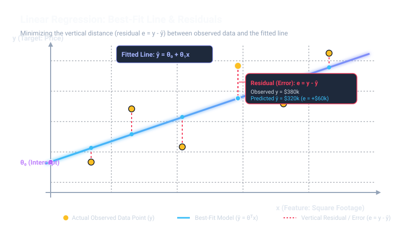
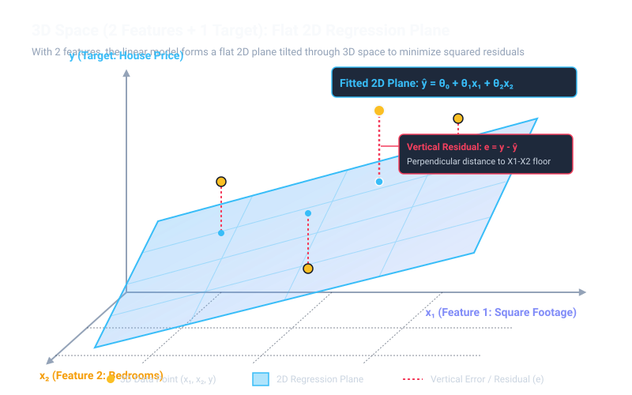
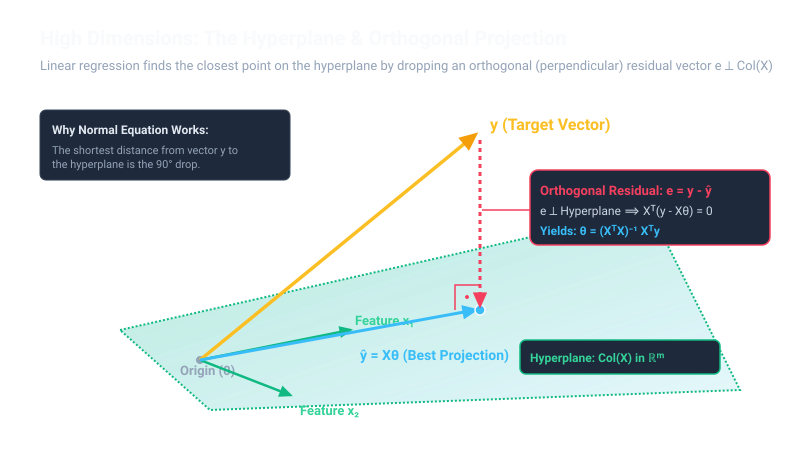

# Linear Regression: Theory, Mathematics, and Practical Implementation

A comprehensive guide to understanding, mathematically deriving, implementing, and deploying Linear Regression for real-world predictive modeling.

---

## Table of Contents
1. [What is Linear Regression?](#1-what-is-linear-regression)
2. [Geometric Intuition](#2-geometric-intuition)
3. [The Mathematical Formulation](#3-the-mathematical-formulation)
   - [3.1 The Hypothesis Function](#31-the-hypothesis-function)
   - [3.2 The Cost Function (Ordinary Least Squares)](#32-the-cost-function-ordinary-least-squares)
   - [3.3 Optimization 1: Batch Gradient Descent](#33-optimization-1-batch-gradient-descent)
   - [3.4 Optimization 2: Analytical Normal Equation](#34-optimization-2-analytical-normal-equation)
   - [3.5 Regularization (Ridge & Lasso)](#35-regularization-ridge--lasso)
4. [Core Statistical Assumptions](#4-core-statistical-assumptions)
5. [How to Implement It](#5-how-to-implement-it)
   - [Implementation A: From Scratch (Pure NumPy)](#implementation-a-from-scratch-pure-numpy)
   - [Implementation B: Production Pipeline (Scikit-Learn)](#implementation-b-production-pipeline-scikit-learn)
6. [Real-World Use Case: Housing Price Prediction](#6-real-world-use-case-housing-price-prediction)
7. [Evaluation Metrics & Diagnostics](#7-evaluation-metrics--diagnostics)
8. [Notebooks in this Directory](#8-notebooks-in-this-directory)

---

## 1. What is Linear Regression?

**Linear Regression** is a fundamental supervised learning algorithm used to model and quantify the relationship between one or more **independent input features** ($X$) and a **continuous target variable** ($y$).

* **Simple (Univariate) Linear Regression**: Models the target using a single feature (e.g., predicting house price based purely on square footage):
  $$y \approx \theta_0 + \theta_1 x$$
* **Multiple (Multivariate) Linear Regression**: Models the target using multiple features (e.g., predicting house price based on square footage, number of bedrooms, age, and crime rate):
  $$y \approx \theta_0 + \theta_1 x_1 + \theta_2 x_2 + \dots + \theta_n x_n$$

---

## 2. Geometric Intuition

Geometrically, the algorithm finds the **optimal hyperplane** that minimizes the vertical distances (called **residuals**) between the actual data points and the fitted surface:

**Residuals** is the difference between an actual, observed value and the value predicted by your model. It represents the error in a prediction.

The Formula: If $y$ is the actual observed value and $\hat{y}$ is the predicted value, the residual $e$ is calculated as:$$e = y - \hat{y}$$

Why it matters: Analyzing residuals helps determine if a model is accurate. In linear regression, for example, the goal is to find a line of best fit that minimizes the sum of the squared residuals. If a model's residuals show a discernible pattern, it usually means the model is missing key information or is poorly fit.



### Understanding Model Shapes Across Dimensions

To understand what the model looks like visually, remember this fundamental rule:

$$\text{Total Dimensions of the Problem} = \text{Number of Input Features } (X) + \mathbf{1} \text{ Target Variable } (y)$$

The fitted model is always a **flat surface that has one less dimension than the total space**:

#### 1. In 2D Space (1 Feature + 1 Target) $\to$ A 1D Straight Line
* **The Scenario**: Predicting House Price ($y$) from Square Footage ($x_1$).
* **Total Dimensions**: $1 \text{ feature} + 1 \text{ target} = \mathbf{2D \text{ Space}}$ (a flat sheet of paper).
* **Intuition**: The actual data points are scattered dots on the page. The model is a **1-dimensional straight line** drawn through them:
  $$y = \theta_0 + \theta_1 x_1$$
* **Real-World Analogy**: A taut piece of string stretched across a table.

#### 2. In 3D Space (2 Features + 1 Target) $\to$ A Flat 2D Plane
* **The Scenario**: Predicting House Price ($y$) from Square Footage ($x_1$) and Bedrooms ($x_2$).
* **Total Dimensions**: $2 \text{ features} + 1 \text{ target} = \mathbf{3D \text{ Space}}$ (a 3D room).
* **Intuition**: The data points float in the room at different heights (prices). A single thin line cannot fit data that spreads across both width and depth. You need a **flat 2D sheet (a plane)** tilted through the air:
  $$y = \theta_0 + \theta_1 x_1 + \theta_2 x_2$$
* **Real-World Analogy**: A stiff sheet of plywood or pane of glass angled inside a room.



#### 3. In Higher Dimensions ($n$ Features + 1 Target) $\to$ An $n$-Dimensional Hyperplane
* **The Scenario**: Predicting House Price ($y$) from 10 features (sq-ft, bedrooms, bathrooms, crime rate, school rating, etc.).
* **Total Dimensions**: $n \text{ features} + 1 \text{ target} = \mathbf{(n + 1) \text{ Dimensions}}$.
* **What is a "Hyperplane"?**:
  - **"Hyper"** simply means *"in more than 3 dimensions"*.
  - **"Plane"** means *"flat"* (no curves, bends, or waves).
  - Just as a line is flat in 2D, and a sheet of paper is flat in 3D, a **hyperplane** is the exact mathematical term for a **perfectly flat surface in higher-dimensional space**.
* **Geometric View (Orthogonal Vector Projection)**:
  In higher-dimensional linear algebra, fitting linear regression means finding the point $\hat{y}$ on the hyperplane spanned by feature vectors that is as close as possible to the target vector $y$. The residual vector $e = y - \hat{y}$ drops perpendicular (orthogonal) to the entire hyperplane ($X^T(y - X\theta) = 0$).
* **Real-World Analogy**: The flat mathematical extension of a sheet of paper into higher dimensions.



| Input Features ($n$) | Total Space ($n + 1$) | What the Space Looks Like | What the Model Is | Real-World Mental Object |
| :---: | :---: | :---: | :---: | :---: |
| **1 feature** | **2D** | Flat 2D graph | **1D Straight Line** | A taut piece of string |
| **2 features** | **3D** | A 3D room | **2D Flat Plane** | A stiff sheet of plywood |
| **3 features** | **4D** | 4-dimensional space | **3D Hyperplane** | A flat 3D solid slice of 4D space |
| **$n$ features** | **$(n+1)$D** | Higher-dimensional space | **$n$-D Hyperplane** | The flat mathematical equivalent |

---

## 3. The Mathematical Formulation

### 3.1 The Hypothesis Function
Let a dataset contain $m$ training samples and $n$ features:
- $x^{(i)} = [x_1^{(i)}, x_2^{(i)}, \dots, x_n^{(i)}]^T \in \mathbb{R}^n$ represents the feature vector of sample $i$.
- $y^{(i)} \in \mathbb{R}$ represents the ground-truth target.

We introduce a dummy intercept feature $x_0 = 1$. The prediction $\hat{y}$ (hypothesis $h_\theta(x)$) is:

$$h_\theta(x) = \theta_0 x_0 + \theta_1 x_1 + \theta_2 x_2 + \dots + \theta_n x_n = \sum_{j=0}^{n} \theta_j x_j$$

In **vector notation**:
$$h_\theta(x) = \theta^T x$$

For the entire design matrix $X \in \mathbb{R}^{m \times (n+1)}$ and weight vector $\theta \in \mathbb{R}^{(n+1) \times 1}$:

$$\hat{y} = X \theta$$

#### Symbol Breakdown: What Each Term Means

| Symbol / Term | What It Represents | Intuitive Meaning / Example |
| :--- | :--- | :--- |
| **$h_\theta(x)$** or **$\hat{y}$** | **Hypothesis / Predicted Output** | The model's estimated guess for the target (e.g., predicted house price = $320,000). |
| **$x$** | **Input Feature Vector** | The list of measurements for a single sample: $[1, \text{sqft}, \text{bedrooms}, \dots]$. |
| **$x_0 = 1$** | **Bias / Intercept Multiplier** | A dummy constant value of $1$ added so the intercept $\theta_0$ can be treated as a standard dot product. |
| **$x_j$** | **$j$-th Input Feature** | A specific property of the data (e.g., $x_1 = 1500\text{ sq-ft}$, $x_2 = 3\text{ bedrooms}$). |
| **$\theta_0$** | **Bias / Intercept Parameter** | The baseline prediction when all input features are zero (e.g., base land value). |
| **$\theta_j$** | **Weight / Slope for Feature $j$** | How much the prediction $\hat{y}$ changes for every 1-unit increase in $x_j$ (e.g., $+\$150$ per additional sq-ft). |
| **$\theta$** | **Weight / Parameter Vector** | The full column vector containing all weights: $[\theta_0, \theta_1, \dots, \theta_n]^T$. |
| **$X$** | **Design Matrix** | A 2D table of shape $(m \times (n+1))$ containing all $m$ data rows and all $n+1$ feature columns. |
| **$\theta^T x$** | **Dot Product** | Multiplying each feature by its corresponding weight and summing them up: $\theta_0 x_0 + \theta_1 x_1 + \dots$ |

---

### 3.2 The Cost Function (Ordinary Least Squares)
To determine the best parameters $\theta$, we minimize the **Mean Squared Error (MSE)** loss function:

$$J(\theta) = \frac{1}{2m} \sum_{i=1}^{m} \left(h_\theta(x^{(i)}) - y^{(i)}\right)^2$$

In **matrix form**:
$$J(\theta) = \frac{1}{2m} (X\theta - y)^T (X\theta - y)$$

#### Symbol Breakdown: What Each Term Means

| Symbol / Term | What It Represents | Intuitive Meaning / Example |
| :--- | :--- | :--- |
| **$J(\theta)$** | **Cost / Loss Function** | A single score representing how wrong the model is with parameters $\theta$. Lower is better ($0$ = perfect). |
| **$m$** | **Number of Training Samples** | Total count of rows in the dataset (e.g., $m = 500$ houses). |
| **$i$** | **Sample Index** | Refers to a specific row/example in the dataset ($i = 1, 2, \dots, m$). |
| **$y^{(i)}$** | **Actual Target Value** | The ground-truth answer for example $i$ (e.g., actual sold price of house $i = \$350,000$). |
| **$h_\theta(x^{(i)})$** | **Predicted Value for Sample $i$** | What our current model predicted for sample $i$ (e.g., $\hat{y}^{(i)} = \$320,000$). |
| **$(h_\theta(x^{(i)}) - y^{(i)})$** | **Residual / Error** | The prediction error on sample $i$: $(\$320,000 - \$350,000) = -\$30,000$. |
| **$(\dots)^2$** | **Squared Error** | Turns all negative errors positive and heavily penalizes large errors ($-\$30,000^2$). |
| **$\sum_{i=1}^m$** | **Summation** | Adds up the squared errors across all $m$ training houses. |
| **$\frac{1}{m}$** | **Average (Mean)** | Averages the total squared error so the cost doesn't artificially grow just by adding more data rows. |
| **$\frac{1}{2}$** | **Derivative Cancellation Factor** | A mathematical convenience: $\frac{d}{dx}(\frac{1}{2}x^2) = x$, eliminating the factor of $2$ when taking gradients. |
| **$(X\theta - y)$** | **Error Vector** | A column vector of length $m$ containing $( \hat{y}^{(i)} - y^{(i)} )$ for every sample. |

---

### 3.3 Optimization 1: Batch Gradient Descent

Gradient descent starts with arbitrary parameter values (usually zeros) and iteratively updates them in the opposite direction of the gradient of the cost function.

#### Step 1: Derivative of $J(\theta)$
Taking the partial derivative of $J(\theta)$ with respect to each parameter $\theta_j$:

$$\frac{\partial}{\partial \theta_j} J(\theta) = \frac{1}{m} \sum_{i=1}^{m} \left(h_\theta(x^{(i)}) - y^{(i)}\right) x_j^{(i)}$$

In **matrix form**:
$$\nabla_\theta J(\theta) = \frac{1}{m} X^T (X\theta - y)$$

#### Step 2: The Parameter Update Rule
Update all parameters simultaneously on each iteration:

$$\theta := \theta - \alpha \nabla_\theta J(\theta) = \theta - \frac{\alpha}{m} X^T (X\theta - y)$$

#### Symbol Breakdown: What Each Term Means

| Symbol / Term | What It Represents | Intuitive Meaning / Example |
| :--- | :--- | :--- |
| **$:=$** | **Assignment Operator** | "Compute the right-hand side and overwrite the variable on the left." |
| **$\alpha$ (Alpha)** | **Learning Rate / Step Size** | Controls how big of a step we take down the hill (e.g., $\alpha = 0.01$). If too large, it diverges; if too small, it's slow. |
| **$\nabla_\theta J(\theta)$** | **Gradient Vector** | The vector of partial derivatives pointing in the steepest uphill direction. |
| **$-$ (Minus sign)** | **Negative Gradient Direction** | We subtract because we want to move **downhill** toward minimum cost, not uphill. |
| **$\frac{1}{m} \sum (\dots) x_j^{(i)}$**| **Feature Gradient Component** | Measures how much feature $j$ contributed to the total prediction error. |
| **$x_j^{(i)}$** | **Feature Value Multiplier** | If a feature has large values, a small change in $\theta_j$ causes a big error change; hence $x_j$ scales the gradient. |
| **$X^T$** | **Transpose of Design Matrix** | Flips $X$ from $(m \times (n+1))$ to $((n+1) \times m)$ so matrix multiplication against the $m$-long error vector works. |

---

### 3.4 Optimization 2: Analytical Normal Equation

Because the cost function is convex, its global minimum occurs where the gradient vector is exactly zero:

$$\nabla_\theta J(\theta) = \mathbf{0}$$

$$\frac{1}{m} X^T (X\theta - y) = \mathbf{0}$$

$$X^T X \theta - X^T y = \mathbf{0}$$

$$X^T X \theta = X^T y$$

Pre-multiplying both sides by the inverse $(X^T X)^{-1}$ (or Moore-Penrose pseudo-inverse):

$$\theta = (X^T X)^{-1} X^T y$$

#### Symbol Breakdown: What Each Term Means

| Symbol / Term | What It Represents | Intuitive Meaning / Example |
| :--- | :--- | :--- |
| **$\theta$** | **Optimal Weights** | The exact closed-form vector of parameters that gives minimum MSE without any iterations. |
| **$X^T X$** | **Feature Gram / Covariance Matrix** | Shape $((n+1) \times (n+1))$. Encodes the relationships and correlations between all input features. |
| **$(X^T X)^{-1}$** | **Matrix Inverse** | The inverse matrix satisfying $(X^T X)^{-1}(X^T X) = I$. In practice, `np.linalg.pinv` is used for stability. |
| **$X^T y$** | **Feature-Target Projection Vector** | Shape $((n+1) \times 1)$. Encodes the correlation between each feature and the actual target $y$. |

#### When to choose which optimization method?

| Criterion | Gradient Descent | Normal Equation |
| :--- | :--- | :--- |
| **Learning Rate $\alpha$** | Must be chosen and tuned | Not required |
| **Iterations** | Requires hundreds/thousands of steps | Closed-form (1 step) |
| **Feature Scaling** | **Required** for fast, stable convergence | Not required |
| **Complexity** | $\mathcal{O}(k \cdot m \cdot n)$ | $\mathcal{O}(n^3)$ (matrix inversion) |
| **Recommendation** | Ideal for large datasets ($n > 10,000$ features) | Fast for small datasets ($n < 10,000$) |

---

### 3.5 Regularization (Ridge & Lasso)

Ridge and Lasso are two popular "upgrades" to standard linear regression. They are techniques used to fix one of the biggest problems in machine learning: overfitting.

When features are collinear or the model overfits, coefficients can grow excessively large. Regularization adds a penalty term to the loss function:

#### 1. Ridge Regression ($L_2$ Penalty)
Shrinks coefficients smoothly towards zero:
$$J_{\text{Ridge}}(\theta) = \frac{1}{2m} \sum_{i=1}^m \left(h_\theta(x^{(i)}) - y^{(i)}\right)^2 + \lambda \sum_{j=1}^n \theta_j^2$$
*Normal Equation with Ridge:*
$$\theta = (X^T X + \lambda I')^{-1} X^T y$$

#### 2. Lasso Regression ($L_1$ Penalty)
Drives redundant or less informative weights **strictly to zero**, performing automatic feature selection:
$$J_{\text{Lasso}}(\theta) = \frac{1}{2m} \sum_{i=1}^m \left(h_\theta(x^{(i)}) - y^{(i)}\right)^2 + \lambda \sum_{j=1}^n |\theta_j|$$

---

## 4. Core Statistical Assumptions

Linear Regression produces unbiased, minimum-variance estimates (Gauss-Markov Theorem) when the following assumptions hold:

1. **Linearity**: The relationship between features $X$ and the mean of target $y$ is linear in parameters.
2. **Homoscedasticity**: The residuals have constant variance across all levels of the predicted values (no funnel-shaped spread).
3. **No Multicollinearity**: Independent variables are not highly correlated with each other (Variance Inflation Factor $\text{VIF} < 5$).
4. **Independence of Residuals**: Observations and errors are independent (checked using the Durbin-Watson statistic).
5. **Normality of Errors**: Residuals are approximately normally distributed (verified using Q-Q plots or Shapiro-Wilk test).

---

## 5. How to Implement It

### Implementation A: From Scratch (Pure NumPy)

```python
import numpy as np

class LinearRegressionScratch:
    def __init__(self, learning_rate=0.01, n_iterations=1000):
        self.lr = learning_rate
        self.n_iterations = n_iterations
        self.theta = None
        self.cost_history = []

    def fit(self, X, y):
        """
        Fits linear regression model using Batch Gradient Descent.
        X: shape (m, n)
        y: shape (m,) or (m, 1)
        """
        m, n = X.shape
        y = y.reshape(-1, 1)

        # Add bias column (x0 = 1) -> X_b shape: (m, n + 1)
        X_b = np.hstack([np.ones((m, 1)), X])

        # Initialize weights to zeros: shape (n + 1, 1)
        self.theta = np.zeros((n + 1, 1))

        # Gradient Descent loop
        for _ in range(self.n_iterations):
            predictions = X_b.dot(self.theta)
            errors = predictions - y
            gradient = (1 / m) * X_b.T.dot(errors)
            self.theta -= self.lr * gradient
            
            # Compute cost: J = (1 / 2m) * sum(errors^2)
            cost = (1 / (2 * m)) * np.sum(errors ** 2)
            self.cost_history.append(cost)

        return self

    def predict(self, X):
        m = X.shape[0]
        X_b = np.hstack([np.ones((m, 1)), X])
        return X_b.dot(self.theta)

    def fit_normal_equation(self, X, y):
        """Closed-form analytical solution"""
        m = X.shape[0]
        X_b = np.hstack([np.ones((m, 1)), X])
        y = y.reshape(-1, 1)
        self.theta = np.linalg.pinv(X_b.T.dot(X_b)).dot(X_b.T).dot(y)
        return self
```

---

### Implementation B: Production Pipeline (Scikit-Learn)

```python
from sklearn.datasets import fetch_california_housing
from sklearn.model_selection import train_test_split
from sklearn.preprocessing import StandardScaler
from sklearn.linear_model import LinearRegression
from sklearn.pipeline import make_pipeline
from sklearn.metrics import mean_squared_error, mean_absolute_error, r2_score
import numpy as np

# 1. Load Data
data = fetch_california_housing()
X, y = data.data, data.target

# 2. Train/Test Split (Never fit scalers on test data to prevent leakage)
X_train, X_test, y_train, y_test = train_test_split(
    X, y, test_size=0.2, random_state=42
)

# 3. Create Pipeline: Standardize features and fit Linear Regression
model_pipeline = make_pipeline(
    StandardScaler(),
    LinearRegression()
)

# 4. Train Model
model_pipeline.fit(X_train, y_train)

# 5. Predict & Evaluate
y_pred = model_pipeline.predict(X_test)
print(f"R² Score: {r2_score(y_test, y_pred):.4f}")
print(f"RMSE:     {np.sqrt(mean_squared_error(y_test, y_pred)):.4f}")
print(f"MAE:      {mean_absolute_error(y_test, y_pred):.4f}")
```

---

## 6. Real-World Use Case: Housing Price Prediction

Suppose a financial firm wants to estimate home values:

```
[Raw Features]                [Preprocessing]             [Trained Model]          [Output]
Square Feet (e.g. 2100)  -->  Z-Score Normalization  -->  ŷ = θ₀ + θ₁x₁ + ... -->  Estimated Price:
Bedrooms (e.g. 3)             (x - μ) / σ                                           $345,000
Age (e.g. 10 yrs)
```

1. **Problem Definition**: Target $y$ is continuous (price in dollars).
2. **Data Collection & Cleaning**: Remove outliers, handle missing values, log-transform skewed features.
3. **Feature Scaling**: Bring variables to standard scale so gradient descent converges uniformly.
4. **Model Training**: Fit parameters $\theta$.
5. **Inference**: Take a new unseen property profile and compute $\hat{y} = x^T \theta$.

---

## 7. Evaluation Metrics & Diagnostics

* **Mean Absolute Error (MAE)**:
  $$\text{MAE} = \frac{1}{m}\sum_{i=1}^m |y^{(i)} - \hat{y}^{(i)}|$$
* **Root Mean Squared Error (RMSE)**:
  $$\text{RMSE} = \sqrt{\frac{1}{m}\sum_{i=1}^m (y^{(i)} - \hat{y}^{(i)})^2}$$
* **Coefficient of Determination ($R^2$)**:
  $$R^2 = 1 - \frac{\sum (y^{(i)} - \hat{y}^{(i)})^2}{\sum (y^{(i)} - \bar{y})^2}$$
  - $R^2 = 1.0$: Perfect explanation of target variance.
  - $R^2 = 0.0$: Explains none of the variance (same as predicting sample mean $\bar{y}$).
* **Residual Analysis**: Plot predicted values $\hat{y}$ vs. residuals $(y - \hat{y})$. Residuals should be randomly distributed around the horizontal line $y=0$ without distinct curved patterns.

---

## 8. Notebooks in this Directory

This directory contains two complementary notebooks:

1. **[`Linear_regression.ipynb`](./Linear_regression.ipynb)**:
   - Practical, production-style machine learning using **Scikit-Learn**.
   - Real-world California Housing dataset, data scaling with `StandardScaler`, `LinearRegression`, and `SGDRegressor`.
   - Residual analysis, non-linear basis expansion, and **Ridge ($L_2$)** & **Lasso ($L_1$)** regularization.

2. **[`Programming Exercise 1 - Linear Regression_Full.ipynb`](./Programming%20Exercise%201%20-%20Linear%20Regression_Full.ipynb)**:
   - Foundational, mathematical, **from-scratch** implementation using pure **NumPy**.
   - Vectorized cost function $J(\theta)$, manual gradient descent update loops, 2D contour & 3D surface loss landscape plotting, and closed-form Normal Equations.
