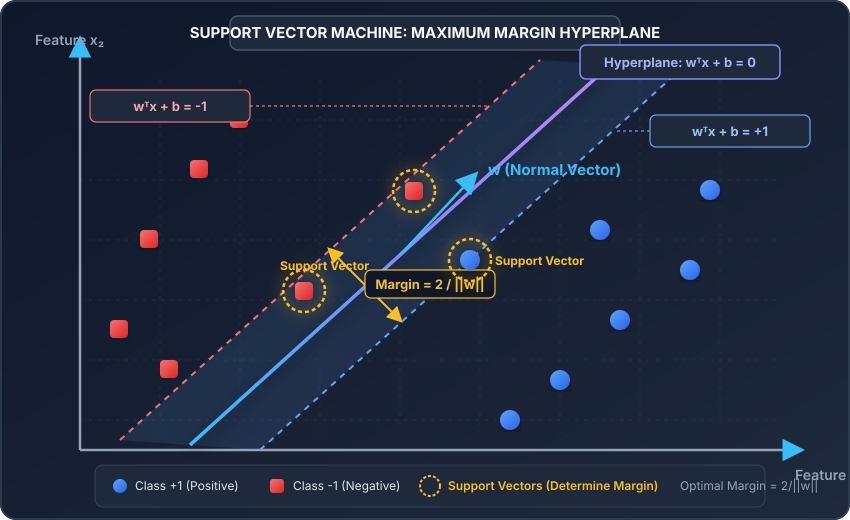
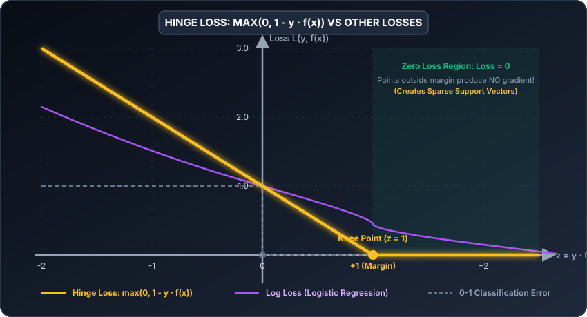
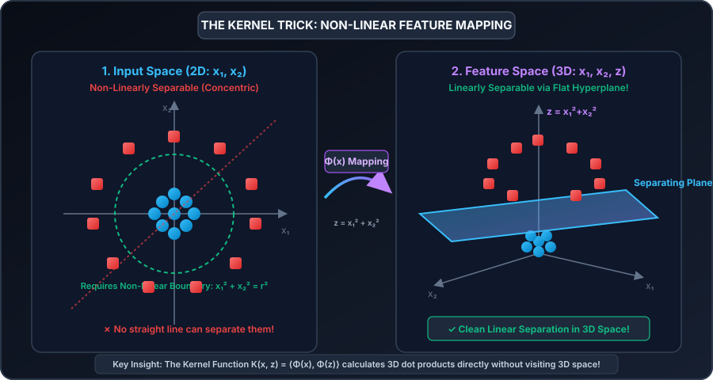
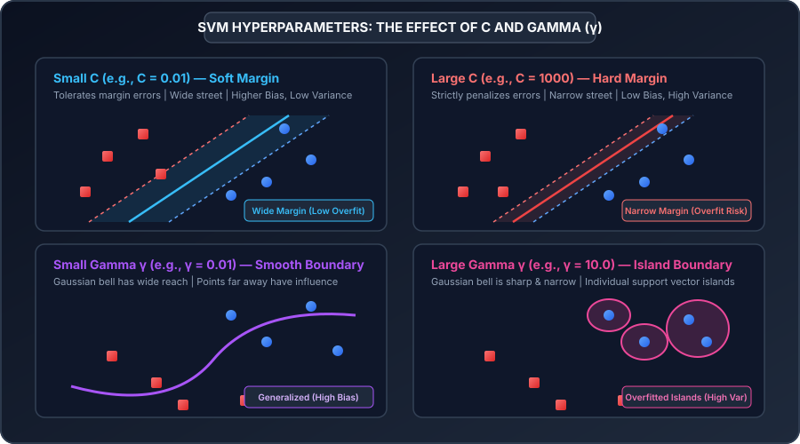

# Support Vector Machine (SVM): Theory, Mathematics, and Practical Implementation

A comprehensive guide to understanding, mathematically formulating, deriving, implementing, and diagnosing Support Vector Machines (SVM) for linear, non-linear classification, and regression.

---

## Table of Contents
1. [What is a Support Vector Machine?](#1-what-is-a-support-vector-machine)
   - [The Philosophy of the Maximal Margin](#the-philosophy-of-the-maximal-margin)
   - [Why SVM Over Logistic Regression or Perceptrons?](#why-svm-over-logistic-regression-or-perceptrons)
2. [Geometric Intuition & The Concept of Margin](#2-geometric-intuition--the-concept-of-margin)
   - [2.1 The Separating Hyperplane](#21-the-separating-hyperplane)
   - [2.2 Functional Margin vs. Geometric Margin](#22-functional-margin-vs-geometric-margin)
   - [2.3 Derivation of Margin Width (2 / ||w||)](#23-derivation-of-margin-width-2--w)
   - [2.4 What Exactly Are Support Vectors?](#24-what-exactly-are-support-vectors)
3. [The Mathematical Formulation](#3-the-mathematical-formulation)
   - [3.1 Hard-Margin SVM (Linearly Separable Case)](#31-hard-margin-svm-linearly-separable-case)
   - [3.2 Soft-Margin SVM & Slack Variables (Non-Separable Case)](#32-soft-margin-svm--slack-variables-non-separable-case)
   - [3.3 The Hinge Loss Formulation](#33-the-hinge-loss-formulation)
   - [3.4 The Dual Formulation & Karush-Kuhn-Tucker (KKT) Conditions](#34-the-dual-formulation--karush-kuhn-tucker-kkt-conditions)
   - [3.5 The Kernel Trick (Non-Linear Classification)](#35-the-kernel-trick-non-linear-classification)
   - [3.6 Hyperparameters: Bias-Variance Tradeoff of C and Gamma](#36-hyperparameters-bias-variance-tradeoff-of-c-and-gamma)
   - [3.7 Support Vector Regression (SVR & The ε-Insensitive Tube)](#37-support-vector-regression-svr--the-ε-insensitive-tube)
4. [Core Assumptions, Properties & Limitations](#4-core-assumptions-properties--limitations)
5. [How to Implement It](#5-how-to-implement-it)
   - [Implementation A: Pure NumPy from Scratch (Hinge Loss Gradient Descent)](#implementation-a-pure-numpy-from-scratch-hinge-loss-gradient-descent)
   - [Implementation B: Production Pipeline with Scikit-Learn (SVC & RBF Kernel)](#implementation-b-production-pipeline-with-scikit-learn-svc--rbf-kernel)
6. [Real-World Use Case: Clinical Diabetes Classification](#6-real-world-use-case-clinical-diabetes-classification)
7. [Evaluation Metrics & Diagnostics for SVM](#7-evaluation-metrics--diagnostics-for-svm)
8. [Notebooks in this Directory](#8-notebooks-in-this-directory)

---

## 1. What is a Support Vector Machine?

A **Support Vector Machine (SVM)** is a powerful, mathematically rigorous supervised learning algorithm used primarily for **classification** (Support Vector Classification, or **SVC**) and **regression** (Support Vector Regression, or **SVR**). Introduced in its modern form by Vladimir Vapnik and Corinna Cortes in 1995, SVM is grounded in **Statistical Learning Theory** and **Vapnik-Chervonenkis (VC) Dimension**.

While algorithms like Logistic Regression find *any* decision boundary that separates classes by maximizing likelihood, an SVM searches for the single **optimal boundary** that maximizes the distance (the "margin") between the boundary and the nearest data points of any class.

```
       Logistic Regression / Perceptron:                Support Vector Machine (SVM):
     Any separating boundary is acceptable.        Finds the unique MAXIMUM MARGIN boundary.

           x₂ ^                                           x₂ ^           wᵀx + b = 0
              |    ●   ●   Boundary A                        |    ●   ●    /
              |   /  ●    /                                  |     ●      /   ★ Support Vector
              |  /       / Boundary B                        |   -------★/------  wᵀx + b = +1
              | /       /                                    |         / |
              |/  ■    /                                     |        /  | Margin = 2/||w||
              |  ■   ■                                       |  -----★---/--  wᵀx + b = -1
              +-------------------> x₁                       |   ■  /■
                                                             +-------------------> x₁
```

### Target Variable Convention in SVM ($y \in \{-1, +1\}$)
Unlike Logistic Regression, which encodes binary targets as $y \in \{0, 1\}$, SVM formulations universally use:

$$y^{(i)} \in \{-1, +1\}$$

* **Positive Class ($+1$)**: e.g., Spam, Malignant, Diabetic Patient.
* **Negative Class ($-1$)**: e.g., Legitimate, Benign, Healthy Patient.

This symmetry enables the elegant mathematical condition that a prediction $\hat{y} = \text{sign}(w^T x + b)$ is correct if and only if:

$$y^{(i)} \cdot (w^T x^{(i)} + b) > 0$$

---

### Why SVM Over Logistic Regression or Perceptrons?

1. **Robust Generalization (Maximum Margin)**: A boundary passing millimeters away from a training point is brittle to noisy test data. Maximizing the margin ensures the greatest possible tolerance to unseen data perturbations.
2. **Global Convex Minimum**: The SVM optimization problem is a **Convex Quadratic Program (QP)**. Unlike Deep Neural Networks, SVM has **no local minima**—the solution is globally optimal and unique.
3. **Memory Efficiency (Sparsity)**: Once trained, the model discards all non-boundary training data! The entire model is stored purely as a handful of critical points called **Support Vectors**.
4. **Effective in Ultra-High Dimensional Spaces**: SVM excels when the number of features $d$ is greater than the number of observations $m$ (e.g., genomic microarray data, text classification).
5. **The Kernel Trick**: Through kernel functions, SVM effortlessly models complex, non-linear boundaries in infinite-dimensional Hilbert spaces without ever paying the computational penalty of computing higher-dimensional coordinates.

---

## 2. Geometric Intuition & The Concept of Margin



### 2.1 The Separating Hyperplane

In an $n$-dimensional feature space $\mathbb{R}^n$, a **hyperplane** is an affine subspace of dimension $n - 1$:
* In **2D Space** ($n = 2$): A hyperplane is a **1D flat line** ($w_1 x_1 + w_2 x_2 + b = 0$).
* In **3D Space** ($n = 3$): A hyperplane is a **2D flat plane** ($w_1 x_1 + w_2 x_2 + w_3 x_3 + b = 0$).
* In **$n$-D Space** ($n > 3$): A hyperplane is an **$(n-1)$-dimensional flat decision boundary**.

The equation of the decision hyperplane is:

$$w^T x + b = 0$$

The decision rule (hypothesis) for classifying a new query point $x$ is:

$$h(x) = \text{sign}(w^T x + b) = \begin{cases} +1 & \text{if } w^T x + b \ge 0 \\ -1 & \text{if } w^T x + b < 0 \end{cases}$$

#### Symbol Breakdown: What Each Term Means

| Symbol / Term | Formal Mathematical Definition | Plain-English Meaning & Physical Role | Example / Value Range |
| :--- | :--- | :--- | :--- |
| **$h(x)$** | Predicted class label output | The final discrete decision of the model | $\{-1, +1\}$ |
| **$\text{sign}(\cdot)$** | Signum step function | Returns $+1$ if the input argument is non-negative, and $-1$ if negative | $\text{sign}(2.4) = +1$, $\text{sign}(-0.8) = -1$ |
| **$w$** | Weight vector $[w_1, w_2, \dots, w_n]^T \in \mathbb{R}^n$ | **Normal vector** perpendicular (orthogonal) to the hyperplane. Dictates the angle/orientation of the boundary. | Vector of real numbers: $[0.75, -1.20]^T$ |
| **$w^T$** | Transpose of the weight vector | Flips column vector to row vector for matrix inner product: $w^T x = \sum_{j=1}^n w_j x_j$ | Row vector: $[w_1, w_2, \dots, w_n]$ |
| **$x$** | Feature input vector $[x_1, x_2, \dots, x_n]^T$ | The measured numerical attributes of a single sample | e.g., $[\text{Age}, \text{BMI}]^T = [45, 28.3]^T$ |
| **$b$** | Bias scalar term $b \in \mathbb{R}$ | **Offset / Intercept** of the hyperplane from the origin $(0, 0)$. Controls the position of the plane along $w$. | e.g., $-2.5$ |
| **$0$** | Decision threshold | The neutral boundary surface where confidence is zero and distance to both classes is equal. | Exactly $0.0$ |

---

### 2.2 Functional Margin vs. Geometric Margin

To understand how SVM measures boundary confidence, we distinguish between two definitions of margin:

#### 1. Functional Margin
The **functional margin** of the hyperplane with respect to a training instance $(x^{(i)}, y^{(i)})$ is defined as:

$$\hat{\gamma}^{(i)} = y^{(i)}(w^T x^{(i)} + b)$$

* If $y^{(i)} = +1$ and $w^T x^{(i)} + b \gg 0$, $\hat{\gamma}^{(i)}$ is a large positive number (confident correct prediction).
* If $y^{(i)} = -1$ and $w^T x^{(i)} + b \ll 0$, $\hat{\gamma}^{(i)} = (-1)(\text{negative}) > 0$ (confident correct prediction).
* If $y^{(i)}(w^T x^{(i)} + b) < 0$, the point is misclassified.

> [!WARNING]
> **The Flaw of Functional Margin**: If we arbitrarily rescale $w \to 2w$ and $b \to 2b$, the physical hyperplane $2w^T x + 2b = 0$ remains identical, but the functional margin doubles ($\hat{\gamma} \to 2\hat{\gamma}$). To prevent artificial scaling tricks, we must normalize by the Euclidean length of $w$.

#### 2. Geometric Margin
The **geometric margin** is the actual **Euclidean physical distance** from point $x^{(i)}$ to the hyperplane:

$$\gamma^{(i)} = \frac{y^{(i)}(w^T x^{(i)} + b)}{\|w\|_2}$$

where $\|w\|_2 = \sqrt{w_1^2 + w_2^2 + \dots + w_n^2}$ is the $\ell_2$-norm of the weight vector.

#### Symbol Breakdown: What Each Term Means

| Symbol / Term | Formal Name | Meaning in Practice |
| :--- | :--- | :--- |
| **$\gamma^{(i)}$** | **Geometric Margin** | The true physical distance (in inches, centimeters, or feature units) from sample $x^{(i)}$ to the decision boundary. |
| **$y^{(i)}$** | Ground Truth Label | The known true class of sample $i$ ($+1$ or $-1$). |
| **$(w^T x^{(i)} + b)$** | Raw Functional Score | The signed algebraic distance from the point to the boundary. |
| **$\|w\|_2$** | Euclidean $\ell_2$ Norm of $w$ | The geometric length of vector $w$: $\sqrt{\sum_{j=1}^n w_j^2}$. Normalizes the algebraic distance into true Euclidean length. |

---

### 2.3 Derivation of Margin Width (2 / ||w||)

Let $x_+$ be a support vector on the positive margin boundary, so:

$$w^T x_+ + b = +1$$

Let $x_-$ be a support vector on the negative margin boundary, so:

$$w^T x_- + b = -1$$

Subtracting the two equations yields:

$$w^T (x_+ - x_-) = 1 - (-1) = 2$$

Since the vector $(x_+ - x_-)$ connects the two margins, the perpendicular width of the margin street (the total geometric margin $M$) is the projection of $(x_+ - x_-)$ onto the unit normal vector $\hat{u} = \frac{w}{\|w\|}$:

$$\text{Margin } M = \frac{w^T (x_+ - x_-)}{\|w\|} = \frac{2}{\|w\|}$$

$$\text{Total Margin Width } = \frac{2}{\|w\|}$$

$$\text{Half Margin (Distance to Hyperplane)} = \frac{1}{\|w\|}$$

```
                Positive Margin Boundary:  wᵀx + b = +1
                                      ▲
                                      │  Distance = 1/||w||
                                      ▼
             Optimal Separating Plane:  wᵀx + b = 0    Total Margin = 2/||w||
                                      ▲
                                      │  Distance = 1/||w||
                                      ▼
                Negative Margin Boundary:  wᵀx + b = -1
```

#### Key Takeaway:
To maximize the total margin $\frac{2}{\|w\|}$, we must **minimize $\|w\|$** (or equivalently, minimize $\frac{1}{2}\|w\|^2$).

---

### 2.4 What Exactly Are Support Vectors?

In the diagram above:
* Most data points lie far away from the margin corridor ($y^{(i)}(w^T x^{(i)} + b) > 1$). If you delete, move, or add 10,000 of these points far from the boundary, **the optimal hyperplane does not move by even one millimeter**.
* The only points that matter are the critical border points sitting directly on the margin boundaries ($w^T x + b = \pm 1$) or violating them.
* These critical points are called **Support Vectors** because they physically "prop up" and determine the separating hyperplane.
* If you move a single support vector by even $0.01$, the entire hyperplane rotates or shifts.

---

## 3. The Mathematical Formulation

### 3.1 Hard-Margin SVM (Linearly Separable Case)

When data is perfectly linearly separable without any overlapping points, we enforce that every single training instance must lie on or outside its correct margin boundary ($y^{(i)}(w^T x^{(i)} + b) \ge 1$).

We formalize this as a constrained convex quadratic optimization problem:

$$\min_{w, b} \frac{1}{2} \|w\|^2$$

$$\text{subject to: } y^{(i)}(w^T x^{(i)} + b) \ge 1, \quad \forall i \in \{1, 2, \dots, m\}$$

#### Why Minimize $\frac{1}{2}\|w\|^2$ Instead of Maximizing $\frac{2}{\|w\|}$?
1. Maximizing $\frac{2}{\|w\|}$ is mathematically equivalent to minimizing $\frac{\|w\|}{2}$.
2. Squaring the norm ($\|w\|^2 = w^T w = \sum w_j^2$) eliminates the square root, transforming the objective into a clean quadratic function.
3. Multiplying by $\frac{1}{2}$ cancels the factor of $2$ during differentiation ($\frac{d}{dw} \frac{1}{2} w^2 = w$).
4. The objective $\frac{1}{2}\|w\|^2$ is **strictly convex**, guaranteeing a unique global minimum with zero local minima.

#### Symbol Breakdown: What Each Term Means

| Term / Expression | Mathematical Nature | Plain-English Role |
| :--- | :--- | :--- |
| **$\min_{w, b}$** | Optimization operator | Instructs the solver to find the optimal values of $w$ and $b$ that yield the lowest possible objective score. |
| **$\frac{1}{2}\|w\|^2$** | Objective function | The quantity being minimized. Minimizing $\|w\|^2$ maximizes the margin $\frac{2}{\|w\|}$. |
| **$\text{subject to}$** | Constraint declaration | Hard mathematical requirements that must never be violated by any data point. |
| **$y^{(i)}(w^T x^{(i)} + b) \ge 1$** | Margin constraint for point $i$ | Forces point $i$ to be on the correct side of the boundary ($>0$) AND outside the margin corridor ($\ge 1$). |
| **$m$** | Dataset size | Total number of training samples ($i = 1, 2, \dots, m$). |

---

### 3.2 Soft-Margin SVM & Slack Variables (Non-Separable Case)

In real-world data, datasets are almost never 100% linearly separable due to noise, overlapping distributions, and outliers. A hard-margin SVM would either:
1. Fail completely (no valid mathematical solution exists), or
2. Yield an ultra-narrow, overfitted margin ruined by a single outlier point.

To solve this, Cortes & Vapnik (1995) introduced **Slack Variables** ($\xi_i \ge 0$, pronounced *"xi"*):

$$\xi_i = \max(0, 1 - y^{(i)}(w^T x^{(i)} + b))$$

```
   y = +1 Region (Blue)               Margin Street               y = -1 Region (Red)
                           wᵀx + b = +1    wᵀx + b = 0    wᵀx + b = -1
                                │               │               │
  ● (Safe point: ξ = 0)         │               │               │
                                │  ● (Margin    │               │
                                │   violator:   │               │
                                │   0 < ξ < 1)  │               │
                                │               │  ● (Misclassified: ξ > 1)
                                │               │               │       ■ (Safe point: ξ = 0)
```

#### Meaning of Slack Variable Values ($\xi_i$):
* **$\xi_i = 0$**: The point is correctly classified and sits on or outside its margin. Zero penalty.
* **$0 < \xi_i \le 1$**: The point is correctly classified, but falls inside the margin corridor. Incurs a small penalty $\xi_i$.
* **$\xi_i > 1$**: The point has crossed the decision boundary ($w^T x + b = 0$) and is **misclassified**. Incurs a penalty proportional to how far it drifted across.

#### The Soft-Margin Optimization Problem:

$$\min_{w, b, \xi} \left[ \frac{1}{2} \|w\|^2 + C \sum_{i=1}^m \xi_i \right]$$

$$\text{subject to: } y^{(i)}(w^T x^{(i)} + b) \ge 1 - \xi_i \quad \text{and} \quad \xi_i \ge 0, \quad \forall i=1, \dots, m$$

#### Symbol Breakdown: What Each Term Means

| Symbol / Term | Mathematical Name | Meaning in Practice |
| :--- | :--- | :--- |
| **$\frac{1}{2}\|w\|^2$** | **Regularization Term** | Maximizes the margin width $\frac{2}{\|w\|}$. Prevents overfitting. |
| **$\xi_i$** | **Slack Variable** ($\ge 0$) | Measures the degree of margin violation for sample $i$ (how far it penetrated inside the forbidden zone). |
| **$\sum_{i=1}^m \xi_i$** | Total Margin Error | The sum total of all margin violations across the entire training dataset. |
| **$C$** | **Penalty / Regularization Hyperparameter** | A strictly positive scalar ($C > 0$) that balances margin width vs. training errors. |
| **$1 - \xi_i$** | Relaxed margin threshold | Permits point $i$ to violate the strict boundary by an amount up to $\xi_i$. |
| **$\xi_i \ge 0$** | Non-negativity constraint | Ensures points far outside the margin do not earn "negative error" credits to offset other errors. |

---

### 3.3 The Hinge Loss Formulation



The soft-margin problem can be reformulated into an unconstrained Empirical Risk Minimization problem using the **Hinge Loss**:

$$L_{\text{hinge}}(y, f(x)) = \max(0, 1 - y \cdot f(x))$$

The overall cost function to minimize is:

$$J(w, b) = \underbrace{\frac{1}{2} \|w\|^2}_{\text{Margin Maximization (L2 Regularization)}} + C \sum_{i=1}^m \underbrace{\max\left(0, 1 - y^{(i)}(w^T x^{(i)} + b)\right)}_{\text{Empirical Hinge Loss}}$$

#### Why Hinge Loss Creates Sparse Support Vectors:
Look at the graph above:
* For any point with margin $y \cdot f(x) \ge 1$, Hinge loss is **identically 0.0**.
* Its derivative $\frac{\partial L}{\partial w}$ is **exactly 0.0**.
* Therefore, points that are safely classified outside the margin have **zero influence** on updating $w$ and $b$!
* In contrast, Logistic Regression's log loss ($\log(1 + e^{-z})$) asymptotically approaches zero but is never exactly zero—every single data point in logistic regression continuously nudges the boundary!

#### Symbol Breakdown: What Each Term Means

| Term | Formal Definition | Role in Model |
| :--- | :--- | :--- |
| **$J(w, b)$** | Total SVM Loss Function | The overall scalar value minimized during gradient descent or quadratic programming. |
| **$\max(0, \cdot)$** | Max function | Acts as a hinge gate: outputs $0$ if $(1 - y \cdot f(x)) \le 0$, and outputs $(1 - y \cdot f(x))$ otherwise. |
| **$1 - y^{(i)}(w^T x^{(i)} + b)$** | Linear penalty term | The numerical distance by which point $i$ violates the target margin threshold of $1$. |

#### Subgradient Descent Update Rules:
Because the Hinge loss has a sharp "knee" at $z = 1$, it is not differentiable at that exact point. We use **subgradient descent**:

$$\nabla_w J(w) = w - C \sum_{i=1}^m \begin{cases} 0 & \text{if } y^{(i)}(w^T x^{(i)} + b) \ge 1 \\ y^{(i)} x^{(i)} & \text{if } y^{(i)}(w^T x^{(i)} + b) < 1 \end{cases}$$

$$\nabla_b J(b) = - C \sum_{i=1}^m \begin{cases} 0 & \text{if } y^{(i)}(w^T x^{(i)} + b) \ge 1 \\ y^{(i)} & \text{if } y^{(i)}(w^T x^{(i)} + b) < 1 \end{cases}$$

---

### 3.4 The Dual Formulation & Karush-Kuhn-Tucker (KKT) Conditions

To unlock the **Kernel Trick**, we transform the Primal optimization problem into its **Wolfe Dual** using Lagrange multipliers.

#### Step 1: The Primal Lagrangian
We introduce Lagrange multipliers $\alpha_i \ge 0$ for the margin constraints and $\mu_i \ge 0$ for the slack non-negativity:

$$\mathcal{L}(w, b, \xi, \alpha, \mu) = \frac{1}{2} \|w\|^2 + C \sum_{i=1}^m \xi_i - \sum_{i=1}^m \alpha_i \left[ y^{(i)}(w^T x^{(i)} + b) - 1 + \xi_i \right] - \sum_{i=1}^m \mu_i \xi_i$$

#### Step 2: Setting Derivatives to Zero (Stationarity)
Taking partial derivatives with respect to the primal variables ($w, b, \xi$) and setting them to 0:

$$\frac{\partial \mathcal{L}}{\partial w} = 0 \implies w = \sum_{i=1}^m \alpha_i y^{(i)} x^{(i)}$$

$$\frac{\partial \mathcal{L}}{\partial b} = 0 \implies \sum_{i=1}^m \alpha_i y^{(i)} = 0$$

$$\frac{\partial \mathcal{L}}{\partial \xi_i} = 0 \implies C - \alpha_i - \mu_i = 0 \implies \alpha_i + \mu_i = C$$

Since $\mu_i \ge 0$, the condition $\alpha_i + \mu_i = C$ implies:

$$0 \le \alpha_i \le C$$

#### Step 3: The Wolfe Dual Problem
Substituting $w = \sum \alpha_i y^{(i)} x^{(i)}$ back into the Lagrangian eliminates $w, b,$ and $\xi$, yielding the **Dual Problem**:

$$\max_{\alpha} \left[ \sum_{i=1}^m \alpha_i - \frac{1}{2} \sum_{i=1}^m \sum_{j=1}^m \alpha_i \alpha_j y^{(i)} y^{(j)} \left( x^{(i)} \cdot x^{(j)} \right) \right]$$

$$\text{subject to: } 0 \le \alpha_i \le C \quad \forall i=1, \dots, m \quad \text{and} \quad \sum_{i=1}^m \alpha_i y^{(i)} = 0$$

#### The Three Groundbreaking Insights of the Dual:
1. **Dot Product Dependence**: Notice that the training vectors $x^{(i)}$ and $x^{(j)}$ appear **only as an inner (dot) product** $(x^{(i)} \cdot x^{(j)})$. The individual feature coordinates are never needed!
2. **Extreme Sparsity**: By the KKT Complementary Slackness condition:
   $$\alpha_i \left[ y^{(i)}(w^T x^{(i)} + b) - 1 + \xi_i \right] = 0$$
   * For every point safely outside the margin: $\alpha_i = 0$.
   * Only the **support vectors** have $\alpha_i > 0$!
3. **The Gateway to Kernels**: Because the objective depends solely on $(x^{(i)} \cdot x^{(j)})$, we can replace this dot product with a non-linear Kernel Function $K(x^{(i)}, x^{(j)})$.

#### Symbol Breakdown: What Each Term Means

| Symbol / Term | Formal Definition | Practical Meaning |
| :--- | :--- | :--- |
| **$\alpha_i$** | Lagrange Multiplier for sample $i$ | The "importance weight" of sample $i$. If $\alpha_i = 0$, point $i$ is irrelevant. If $\alpha_i > 0$, point $i$ is an active support vector. |
| **$\alpha_j$** | Lagrange Multiplier for sample $j$ | Allows pair-wise comparison of point $i$ and point $j$. |
| **$y^{(i)} y^{(j)}$** | Label alignment term | Equals $+1$ if points $i$ and $j$ have the same class; equals $-1$ if they belong to opposite classes. |
| **$x^{(i)} \cdot x^{(j)}$** | Inner (Dot) Product | Measures the geometric similarity/cosine correlation between sample $i$ and sample $j$. |
| **$0 \le \alpha_i \le C$** | Box Constraint | Limits the maximum influence of any single support vector to $C$, preventing outliers from dominating. |
| **$\sum_{i=1}^m \alpha_i y^{(i)} = 0$** | Equality Constraint | Enforces balance: the total weighted pull of positive support vectors must equal negative support vectors. |

---

### 3.5 The Kernel Trick (Non-Linear Classification)



When data is not linearly separable in the original input space $\mathbb{R}^n$ (e.g., circular concentric rings or an XOR pattern), linear classifiers fail completely.

The classical solution is to project the data into a higher-dimensional feature space $\mathbb{R}^D$ ($D \gg n$) using a non-linear mapping function $\phi(x)$:

$$x \in \mathbb{R}^n \xrightarrow{\quad \phi \quad} \phi(x) \in \mathbb{R}^D$$

In this higher-dimensional space, the points become linearly separable by a flat hyperplane!

#### The Computational Bottleneck:
If $x$ has 1,000 features and we project to a polynomial space of degree 3, the feature vector $\phi(x)$ has over **166 million dimensions**! Computing, storing, and taking dot products between 166-million-dimensional vectors would instantly freeze the computer's memory and CPU.

#### The Magic Solution: Mercer's Theorem & The Kernel Trick
A **Kernel Function** $K(x, z)$ computes the dot product in the higher-dimensional space **directly using the coordinates in the original lower-dimensional space**:

$$K(x, z) = \langle \phi(x), \phi(z) \rangle$$

We never calculate $\phi(x)$ or visit the higher-dimensional space at all!

```
                    INPUT SPACE ℝ²                                 FEATURE SPACE ℝ³
            (Non-linearly separable rings)                     (Linearly separable bowl)

                   x₂ ^                                              z ^    Separating Plane
                      |   ■ ■ ■                                        |       / / /
                      | ■   ●   ■     Φ(x) = [x₁, x₂, x₁²+x₂²]         |   ■  / / /  ■
                      | ■  ● ●  ■   ───────────────────────────►       |     / / /
                      | ■   ●   ■                                      |    / / /
                      |   ■ ■ ■                                        |   ●  ●  ●
                      +───────────> x₁                                 +──────────────> x₁
```

#### Common Kernel Functions:

##### 1. Linear Kernel
Used when data is linearly separable or when the number of features is already massive ($d \gg m$, such as text classification):

$$K(x, z) = x^T z$$

##### 2. Polynomial Kernel
Models non-linear feature interactions up to degree $d$ (e.g., $x_1 x_2$, $x_1^2, \dots$):

$$K(x, z) = (\gamma x^T z + r)^d$$

##### 3. Radial Basis Function (RBF / Gaussian) Kernel *(Most Popular)*
Maps data implicitly into an **infinite-dimensional Hilbert space**! Measures similarity using a Gaussian bell curve:

$$K(x, z) = \exp\left( -\gamma \|x - z\|^2 \right) = \exp\left( -\frac{\|x - z\|^2}{2\sigma^2} \right)$$

##### 4. Sigmoid (Hyperbolic Tangent) Kernel
Mimics a multilayer perceptron neural network:

$$K(x, z) = \tanh(\gamma x^T z + r)$$

#### Symbol Breakdown: What Each Kernel Parameter Means

| Parameter | Used in Kernels | Meaning & Role | Practical Rule of Thumb |
| :--- | :--- | :--- | :--- |
| **$K(x, z)$** | All | The calculated scalar similarity between samples $x$ and $z$ in feature space. | Value between $0$ (infinitely dissimilar) and $1$ (identical points). |
| **$\|x - z\|^2$** | RBF Kernel | The squared Euclidean distance between two sample vectors in input space. | $\sum_{j=1}^n (x_j - z_j)^2$. |
| **$\gamma$ (gamma)** | RBF, Poly, Sigmoid | Controls the width/curvature of the Gaussian influence bell curve: $\gamma = \frac{1}{2\sigma^2}$. | High $\gamma \implies$ tight islands (overfit). Low $\gamma \implies$ broad smooth curve (underfit). |
| **$d$ (degree)** | Polynomial | The maximum polynomial degree of feature interactions. | Typically $d = 2$ or $d = 3$. High $d$ causes exploding values. |
| **$r$ (`coef0`)** | Poly, Sigmoid | Independent bias constant shifting the inner product before raising to power $d$. | Balances higher-order vs. lower-order terms. Typically $0.0$ or $1.0$. |

---

### 3.6 Hyperparameters: Bias-Variance Tradeoff of C and Gamma



The performance of an SVM depends critically on two hyperparameters: $C$ and $\gamma$.

#### 1. The Penalty Parameter $C$ (Applies to all kernels)
Controls the trade-off between achieving a wide margin and minimizing training errors:

| Parameter Value | Margin Width | Training Error Tolerance | Boundary Behavior | Bias / Variance |
| :--- | :--- | :--- | :--- | :--- |
| **Small $C$** (e.g., $C = 0.01$) | **Wide** | Tolerates many margin violations and errors | Flatter, simpler boundary | **High Bias, Low Variance** (Underfitting risk) |
| **Large $C$** (e.g., $C = 1000$) | **Narrow** | Strictly penalizes violations; tries to classify every point | Wiggly, complex boundary | **Low Bias, High Variance** (Overfitting risk) |

#### 2. The Kernel Coefficient $\gamma$ (Applies to RBF, Poly, Sigmoid)
Defines how far the influence of a single training example reaches:

| Parameter Value | Gaussian Bell Radius | Influence of One Point | Boundary Behavior | Bias / Variance |
| :--- | :--- | :--- | :--- | :--- |
| **Small $\gamma$** (e.g., $\gamma = 0.01$) | **Wide / Broad** | Far away points have significant influence | Ultra-smooth, almost linear boundary | **High Bias, Low Variance** (Underfitting risk) |
| **Large $\gamma$** (e.g., $\gamma = 10.0$) | **Narrow / Spiky** | Only immediately adjacent points have influence | Isolated "islands" around each support vector | **Low Bias, High Variance** (Overfitting risk) |

---

### 3.7 Support Vector Regression (SVR & The ε-Insensitive Tube)

SVM can be adapted for continuous regression through **Support Vector Regression (SVR)**.

Instead of finding a boundary that separates classes, SVR finds a continuous function $f(x) = w^T x + b$ that fits within a margin of tolerance $\epsilon$ (the **$\epsilon$-insensitive tube**):

```
       y ^                          Upper Boundary: f(x) + ε
         |                        /
         |       ★             --/--- ★ (Support vector outside tube, Slack ξ* > 0)
         |                    / /
         |        ●          / /  Predicted Function: f(x) = wᵀx + b
         |                  / / 
         |                 / /  ● (Inside tube: Loss = 0)
         |       ★ -------/--   Lower Boundary: f(x) - ε
         |               /
         +---------------------------------> x
```

The $\epsilon$-insensitive loss function is:

$$L_\epsilon(y, f(x)) = \max(0, |y - f(x)| - \epsilon)$$

* Errors smaller than $\epsilon$ incur **zero loss**!
* Only points lying strictly **outside the tube** act as support vectors and incur linear penalties ($\xi_i$ for points above the tube, $\xi_i^*$ for points below).

#### SVR Optimization Formulation:

$$\min_{w, b, \xi, \xi^*} \left[ \frac{1}{2} \|w\|^2 + C \sum_{i=1}^m (\xi_i + \xi_i^*) \right]$$

$$\text{subject to: } \begin{cases} y^{(i)} - (w^T x^{(i)} + b) \le \epsilon + \xi_i \\ (w^T x^{(i)} + b) - y^{(i)} \le \epsilon + \xi_i^* \\ \xi_i, \xi_i^* \ge 0 \end{cases}$$

#### Symbol Breakdown: What Each Term Means

| Symbol / Term | Meaning in SVR |
| :--- | :--- |
| **$\epsilon$ (epsilon)** | **Tube Radius / Insensitivity Zone**: Width of the margin around the regression line where errors are completely ignored. |
| **$\xi_i$** | Slack variable measuring error for points lying **above** the upper tube boundary ($y^{(i)} - f(x^{(i)}) > \epsilon$). |
| **$\xi_i^*$** | Slack variable measuring error for points lying **below** the lower tube boundary ($f(x^{(i)}) - y^{(i)} > \epsilon$). |
| **$C$** | Trade-off between flatness of the regression line ($\|w\|^2$) and penalizing deviations larger than $\epsilon$. |

---

## 4. Core Assumptions, Properties & Limitations

### 1. Mandatory Feature Scaling
> [!CAUTION]
> **SVM is extremely sensitive to feature scales!**
> The optimization problem minimizes $\|w\|^2 = \sum w_j^2$, and the RBF kernel calculates Euclidean distance $\|x - z\|^2 = \sum (x_j - z_j)^2$. If Feature 1 has a range of $[0, 1]$ (e.g., blood pressure ratio) and Feature 2 has a range of $[0, 1000000]$ (e.g., annual income), Feature 2 will completely drown out Feature 1, distorting the margins. **Always scale features using `StandardScaler`!**

### 2. Time Complexity & Scalability
* **Training Time**: Solving the Quadratic Programming problem via Sequential Minimal Optimization (SMO) scales between $\mathcal{O}(m^2 \cdot n)$ and $\mathcal{O}(m^3)$, where $m$ is the number of samples.
* For datasets with $m > 100,000$ rows, standard `SVC` with an RBF kernel becomes computationally slow. (Use `LinearSVC` or SGD with Hinge loss for massive datasets).
* **Inference Time**: Depends strictly on the number of support vectors $N_{\text{SV}}$: $\mathcal{O}(N_{\text{SV}} \cdot n)$.

### 3. Native Probability Outputs
* Unlike Logistic Regression, standard SVM outputs uncalibrated geometric distances $w^T x + b \in (-\infty, +\infty)$, not probabilities.
* To obtain class probabilities in Scikit-Learn (`probability=True`), the model runs **Platt Scaling** (fitting an internal 5-fold cross-validated logistic sigmoid over the decision scores), which increases training time.

---

## 5. How to Implement It

### Implementation A: Pure NumPy from Scratch (Hinge Loss Gradient Descent)

A complete, production-grade Linear Support Vector Classifier implemented from first principles using vectorized subgradient descent on the Soft-Margin Hinge Loss objective.

```python
import numpy as np


class LinearSVMScratch:
    """Soft-Margin Linear Support Vector Machine Classifier (Pure NumPy).

    Minimizes: (1/2) * ||w||^2 + C * sum(max(0, 1 - y * (w^T x + b)))
    Using Subgradient Descent.
    """

    def __init__(self, learning_rate: float = 0.001, C: float = 1.0, n_iterations: int = 1000):
        self.lr = learning_rate
        self.C = C
        self.n_iterations = n_iterations
        self.w = None
        self.b = None
        self.loss_history = []

    def fit(self, X: np.ndarray, y: np.ndarray):
        """Fit the Linear SVM to training data.

        Parameters:
        -----------
        X : np.ndarray of shape (m, n) -> Training feature matrix
        y : np.ndarray of shape (m,)   -> Binary targets encoded as {-1, +1}
        """
        m, n = X.shape

        # Ensure targets are strictly {-1, +1}
        unique_labels = np.unique(y)
        if not np.array_equal(np.sort(unique_labels), np.array([-1, 1])):
            raise ValueError(f"Targets must be encoded as {{-1, +1}}. Found: {unique_labels}")

        # Initialize weights and bias to zeros
        self.w = np.zeros(n)
        self.b = 0.0

        for epoch in range(self.n_iterations):
            # Compute raw margin functional score: z = y * (Xw + b)
            linear_output = np.dot(X, self.w) + self.b
            margins = y * linear_output

            # Compute current Hinge Loss with L2 Regularization
            hinge_losses = np.maximum(0, 1 - margins)
            loss = 0.5 * np.dot(self.w, self.w) + self.C * np.sum(hinge_losses)
            self.loss_history.append(loss)

            # Identify margin violators (points with margin < 1)
            violators = margins < 1

            # Subgradient calculations:
            # dJ/dw = w - C * sum(y_i * x_i) for all violators
            # dJ/db = - C * sum(y_i) for all violators
            grad_w = self.w - self.C * np.dot(X[violators].T, y[violators])
            grad_b = -self.C * np.sum(y[violators])

            # Gradient Descent step
            self.w -= self.lr * grad_w
            self.b -= self.lr * grad_b

        return self

    def decision_function(self, X: np.ndarray) -> np.ndarray:
        """Compute the signed Euclidean distance to the separating hyperplane: w^T x + b."""
        return np.dot(X, self.w) + self.b

    def predict(self, X: np.ndarray) -> np.ndarray:
        """Predict discrete class label {-1, +1} for input samples."""
        scores = self.decision_function(X)
        return np.where(scores >= 0, 1, -1)


# ==================== VERIFICATION TEST ====================
if __name__ == "__main__":
    from sklearn.datasets import make_blobs
    from sklearn.metrics import accuracy_score

    # Generate linearly separable 2D blobs
    X_syn, y_syn = make_blobs(n_samples=100, centers=2, random_state=42, cluster_std=1.2)
    # Convert {0, 1} to {-1, +1}
    y_syn = np.where(y_syn == 0, -1, 1)

    clf = LinearSVMScratch(learning_rate=0.001, C=1.0, n_iterations=800)
    clf.fit(X_syn, y_syn)
    preds = clf.predict(X_syn)

    print(f"NumPy Linear SVM Accuracy: {accuracy_score(y_syn, preds) * 100:.2f}%")
    print(f"Learned Weights w: {clf.w}")
    print(f"Learned Bias b: {clf.b:.4f}")
    print(f"Margin Width (2 / ||w||): {2.0 / np.linalg.norm(clf.w):.4f}")
```

---

### Implementation B: Production Pipeline with Scikit-Learn (SVC & RBF Kernel)

A complete Scikit-Learn production pipeline demonstrating feature standardization, hyperparameter tuning via 5-fold cross-validated grid search, decision boundary visualization, and support vector extraction.

```python
import matplotlib.pyplot as plt
import numpy as np
from sklearn.datasets import load_breast_cancer
from sklearn.inspection import DecisionBoundaryDisplay
from sklearn.metrics import classification_report, confusion_matrix
from sklearn.model_selection import GridSearchCV, train_test_split
from sklearn.pipeline import Pipeline
from sklearn.preprocessing import StandardScaler
from sklearn.svm import SVC

# 1. Load Clinical Dataset
data = load_breast_cancer()
# Use two primary features for clean 2D decision boundary visualization:
# Feature 0: 'mean radius', Feature 1: 'mean texture'
X = data.data[:, :2]
y = data.target  # 0 = Malignant, 1 = Benign

# 2. Train/Test Stratified Split
X_train, X_test, y_train, y_test = train_test_split(
    X, y, test_size=0.25, random_state=42, stratify=y
)

# 3. Construct Production Pipeline (Mandatory StandardScaler + SVC)
pipe = Pipeline([
    ("scaler", StandardScaler()),
    ("svm", SVC(kernel="rbf", probability=True, random_state=42))
])

# 4. Hyperparameter Tuning Grid (Balancing C and Gamma)
param_grid = {
    "svm__C": [0.1, 1.0, 10.0, 100.0],
    "svm__gamma": ["scale", "auto", 0.01, 0.1, 1.0]
}

grid = GridSearchCV(pipe, param_grid, cv=5, scoring="f1", n_jobs=-1)
grid.fit(X_train, y_train)

best_model = grid.best_estimator_
print(f"Optimal Hyperparameters: {grid.best_params_}")

# 5. Evaluate Performance
y_pred = best_model.predict(X_test)
print("\nClassification Report:")
print(classification_report(y_test, y_pred, target_names=data.target_names))

# 6. Extract and Inspect Support Vectors
svm_step = best_model.named_steps["svm"]
scaler_step = best_model.named_steps["scaler"]
n_sv = svm_step.n_support_

print(f"Total Support Vectors: {sum(n_sv)} (Class 0: {n_sv[0]}, Class 1: {n_sv[1]})")
print(f"Percentage of Dataset as Support Vectors: {sum(n_sv) / len(X_train) * 100:.1f}%")
```

---

## 6. Real-World Use Case: Clinical Diabetes Classification

Matching the experiment in the accompanying lab notebook (`SVM Lab sheet - modify.ipynb`), we evaluate an SVM on patient medical data to classify risk based on **Age** and **Body Mass Index (BMI)**.

```python
import matplotlib.pyplot as plt
import numpy as np
from sklearn.datasets import load_diabetes
from sklearn.inspection import DecisionBoundaryDisplay
from sklearn.metrics import classification_report, confusion_matrix
from sklearn.model_selection import train_test_split
from sklearn.preprocessing import StandardScaler
from sklearn.svm import SVC

# 1. Load Dataset
diabetes = load_diabetes()
# Feature 0: 'age', Feature 2: 'bmi'
X = diabetes.data[:, [0, 2]]
# Convert continuous diabetes progression target into binary classification (Above/Below Average)
y = (diabetes.target > diabetes.target.mean()).astype(int)

# 2. Split Data
X_train, X_test, y_train, y_test = train_test_split(
    X, y, test_size=0.30, random_state=42, stratify=y
)

# 3. Fit Pipeline
scaler = StandardScaler()
X_train_scaled = scaler.fit_transform(X_train)
X_test_scaled = scaler.transform(X_test)

# Train Non-Linear SVM with Radial Basis Function (RBF)
model = SVC(kernel="rbf", C=1.0, gamma="scale", random_state=42)
model.fit(X_train_scaled, y_train)

# 4. Predictions & Evaluation
y_pred = model.predict(X_test_scaled)
print("Confusion Matrix:")
print(confusion_matrix(y_test, y_pred))
print("\nClassification Report:")
print(classification_report(y_test, y_pred, target_names=["Low Risk (0)", "High Risk (1)"]))

# 5. Visualize Decision Boundary and Support Vectors
fig, ax = plt.subplots(figsize=(8, 6))

# Plot the continuous decision boundary
DecisionBoundaryDisplay.from_estimator(
    model,
    X_train_scaled,
    response_method="predict",
    cmap=plt.cm.coolwarm,
    alpha=0.3,
    ax=ax
)

# Plot Data Points
scatter = ax.scatter(
    X_train_scaled[:, 0],
    X_train_scaled[:, 1],
    c=y_train,
    cmap=plt.cm.coolwarm,
    edgecolors="k",
    s=30,
    label="Patients"
)

# Highlight Support Vectors
sv = model.support_vectors_
ax.scatter(
    sv[:, 0],
    sv[:, 1],
    s=100,
    facecolors="none",
    edgecolors="yellow",
    linewidths=1.5,
    label=f"Support Vectors (N={len(sv)})"
)

ax.set_title("SVC Classification: Diabetes Diagnosis (Age vs BMI)", fontsize=13, fontweight="bold")
ax.set_xlabel("Age (Standardized)")
ax.set_ylabel("BMI (Standardized)")
ax.legend(loc="upper left")
plt.show()
```

---

## 7. Evaluation Metrics & Diagnostics for SVM

When validating and diagnosing an SVM model, use the following tools:

### 1. Support Vector Ratio Diagnostic
Inspect the percentage of training samples selected as support vectors:

$$\text{SV Ratio} = \frac{N_{\text{Support Vectors}}}{M_{\text{Training Samples}}}$$

* **If SV Ratio is abnormally high (> 60%–80%)**: The margin is too soft ($C$ is too small) or the RBF kernel is overfitting into tiny islands around every point ($\gamma$ is too high).
* **If SV Ratio is well-calibrated (10%–30%)**: The model achieves high generalization sparsity.

### 2. Decision Function Distance Analysis
Rather than only viewing binary predictions $\{0, 1\}$, extract the continuous geometric distances using:

```python
distances = model.decision_function(X_test)
```

* Points with $|d| \ge 1$ are confident predictions sitting outside the margin.
* Points with $|d| < 1$ are uncertain predictions lying directly inside the margin corridor.

### 3. Metric Comparison Summary

| Metric | Formula | What It Tells You in SVM |
| :--- | :--- | :--- |
| **Accuracy** | $\frac{TP + TN}{TP + TN + FP + FN}$ | Overall percentage of correct classifications across both classes. |
| **Precision** | $\frac{TP}{TP + FP}$ | Out of all patients predicted as High Risk, how many actually had the disease? (Critical to avoid false alarms). |
| **Recall (Sensitivity)** | $\frac{TP}{TP + FN}$ | Out of all actual diabetic patients, how many did the SVM detect? (Critical in medicine—missed diagnoses can be fatal). |
| **F1-Score** | $2 \cdot \frac{\text{Precision} \cdot \text{Recall}}{\text{Precision} + \text{Recall}}$ | Harmonic mean balancing false positives and false negatives. |

---

## 8. Notebooks in this Directory

For interactive code execution, step-by-step visualizations, and experiments, run the Jupyter Notebook in this folder:

* **[SVM Lab sheet - modify.ipynb](./SVM%20Lab%20sheet%20-%20modify.ipynb)**:
  * Interactive synthetic blob separation with Linear SVM.
  * Extraction and visual highlighting of `svm.support_vectors_`.
  * Diabetes patient risk classification using Scikit-Learn's `SVC(kernel="rbf")`.
  * Plotting 2D decision boundaries with `DecisionBoundaryDisplay`.
  * Model evaluation with `confusion_matrix` and `classification_report`.

---

### Key Takeaways Checklist
- [x] **Maximal Margin**: SVM maximizes the perpendicular corridor width $M = \frac{2}{\|w\|}$, yielding superior generalization.
- [x] **Sparsity**: Only points on or violating the margin boundaries ($\alpha_i > 0$) serve as Support Vectors; all other points can be removed without moving the boundary.
- [x] **Hinge Loss**: Penalizes errors linearly ($\max(0, 1 - y \cdot f(x))$), ensuring zero gradient for points outside the margin.
- [x] **Kernel Trick**: Computes inner products $\langle \phi(x), \phi(z) \rangle$ in infinite dimensions without explicit feature transformation.
- [x] **Feature Scaling**: Never run SVM without `StandardScaler`!
