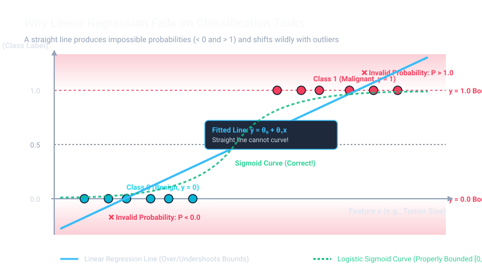
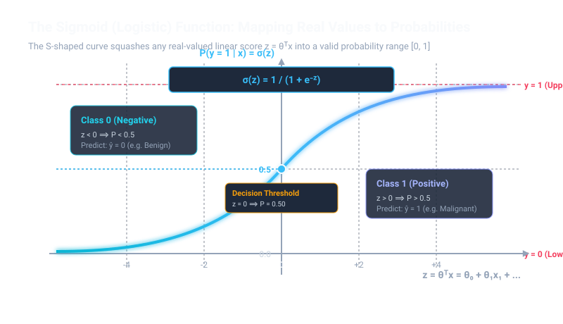
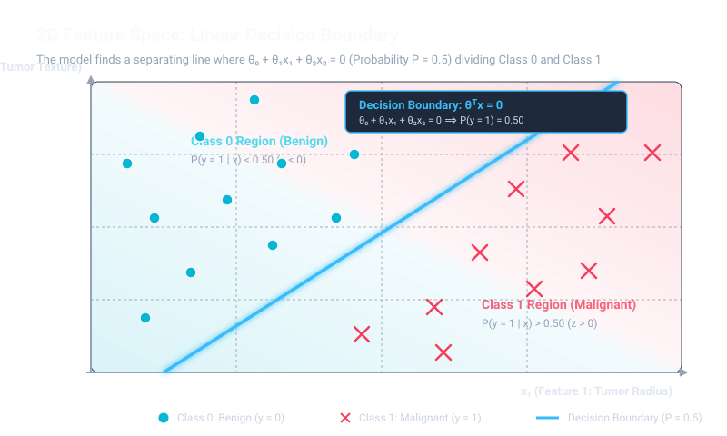
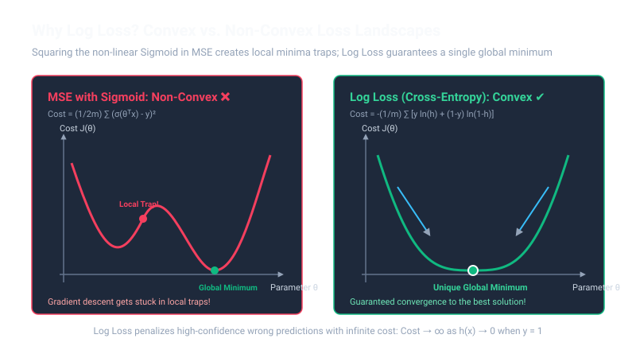

# Logistic Regression: Theory, Mathematics, and Practical Implementation

A comprehensive guide to understanding, mathematically deriving, implementing, and deploying Logistic Regression for binary and multiclass classification.

---

## Table of Contents
1. [What is Logistic Regression?](#1-what-is-logistic-regression)
   - [Why Linear Regression Fails for Classification](#why-linear-regression-fails-for-classification)
2. [Geometric & Probabilistic Intuition](#2-geometric--probabilistic-intuition)
   - [2.1 The Sigmoid (Logistic) Function](#21-the-sigmoid-logistic-function)
   - [2.2 Odds and Log-Odds (The Logit Transformation)](#22-odds-and-log-odds-the-logit-transformation)
   - [2.3 The Decision Boundary Across Dimensions](#23-the-decision-boundary-across-dimensions)
3. [The Mathematical Formulation](#3-the-mathematical-formulation)
   - [3.1 The Hypothesis Function](#31-the-hypothesis-function)
   - [3.2 The Cost Function: Binary Cross-Entropy (Log Loss)](#32-the-cost-function-binary-cross-entropy-log-loss)
   - [3.3 Optimization: Gradient Descent Derivation](#33-optimization-gradient-descent-derivation)
   - [3.4 Why There is No Normal Equation](#34-why-there-is-no-normal-equation)
   - [3.5 Regularization (L1, L2, and Parameter C)](#35-regularization-l1-l2-and-parameter-c)
4. [Core Statistical Assumptions](#4-core-statistical-assumptions)
5. [How to Implement It](#5-how-to-implement-it)
   - [Implementation A: From Scratch (Pure NumPy)](#implementation-a-from-scratch-pure-numpy)
   - [Implementation B: Production Pipeline (Scikit-Learn)](#implementation-b-production-pipeline-scikit-learn)
6. [Real-World Use Case: Breast Cancer Diagnosis](#6-real-world-use-case-breast-cancer-diagnosis)
7. [Classification Evaluation Metrics & Diagnostics](#7-classification-evaluation-metrics--diagnostics)
8. [Notebooks in this Directory](#8-notebooks-in-this-directory)

---

## 1. What is Logistic Regression?

Despite having "regression" in its name, 

Regression is the process of predicting a continuous numerical value based on one or more input variables (features). Classification predicts a category (discrete), Regression predicts a quantity (continuous).

**Logistic Regression** is the foundational algorithm for **Supervised Classification**. Instead of predicting a continuous numerical value (like a house price), it estimates the **probability** that a given input instance belongs to a particular category:

$$P(y = 1 \mid x)$$

* **Binary Classification**: The target variable $y \in \{0, 1\}$ has two possible outcomes (e.g., Spam vs. Ham, Fraud vs. Legitimate, Malignant vs. Benign).
* **Multinomial Classification**: Extended via Softmax regression (One-vs-Rest or Multinomial loss) for $K > 2$ classes (e.g., classifying handwritten digits 0–9).

---

### Why Linear Regression Fails for Classification

Attempting to fit standard linear regression $\hat{y} = \theta^T x$ to classification data leads to two critical flaws:

1. **Unbounded Predictions**: A linear equation produces outputs anywhere from $-\infty$ to $+\infty$. Probabilities must strictly be bounded between $0$ and $1$. Predictions like $\hat{y} = 1.8$ or $\hat{y} = -0.4$ are statistically meaningless as probabilities.

The Problem: Many things in the real world have strict boundaries. For example, a test score must be between 0 and 100. A probability must be between 0% and 100%. A house's price cannot be negative.

The Solution: Because linear regression is unbounded, it is terrible for predicting probabilities. This is why data scientists use a different algorithm called Logistic Regression when they need bounded outputs (it forcibly squashes the predictions to stay between 0 and 1).

2. **Sensitivity to Outliers**: Extreme data points far away from the decision cluster tilt the linear regression line, shifting the decision threshold and dramatically increasing classification errors.

The Problem: Because the errors are squared, small errors stay small, but large errors become mathematically massive. If your model misses a normal data point by 2, the penalty is 4. If an outlier causes the model to miss by 100, the penalty is 10,000.

The Result: The algorithm panics at that massive 10,000 penalty. To fix it, it tilts and yanks the entire hyperplane violently toward the outlier just to reduce that specific error. By trying to accommodate one freak data point, the model ruins its accuracy for the 99% of normal data points.




---

## 2. Geometric & Probabilistic Intuition

### 2.1 The Sigmoid (Logistic) Function

To squash any unbounded real-valued number $z \in (-\infty, +\infty)$ into a valid probability $P \in (0, 1)$, Logistic Regression passes the linear score through the **Sigmoid (logistic) function**:

$$\sigma(z) = \frac{1}{1 + e^{-z}}$$

where $z = \theta^T x = \theta_0 + \theta_1 x_1 + \dots + \theta_n x_n$.



#### Key Properties of the Sigmoid Function:
* As $z \to +\infty$, $e^{-z} \to 0 \implies \sigma(z) \to 1$.
* As $z \to -\infty$, $e^{-z} \to \infty \implies \sigma(z) \to 0$.
* When $z = 0$, $e^{0} = 1 \implies \sigma(0) = \frac{1}{2} = 0.50$ (**The Decision Threshold**).

#### Symbol Breakdown: What Each Term Means

| Symbol / Term | What It Represents | Intuitive Meaning / Example |
| :--- | :--- | :--- |
| **$\sigma(z)$** | **Sigmoid Output** | The squashed probability strictly bounded in $(0, 1)$ (e.g., $0.85 = 85\%$ chance). |
| **$z$** | **Logit / Linear Score** | The raw unbounded number from the linear equation: $\theta_0 + \theta_1 x_1 + \dots$ ($-\infty$ to $+\infty$). |
| **$e$** | **Euler's Number** | Mathematical constant $\approx 2.71828$, base of the exponential function. |
| **$e^{-z}$** | **Exponential Term** | Flips negative scores to large positive numbers, ensuring $\sigma(z) \to 0$ as $z$ gets very negative. |
| **$1$ (Numerator)** | **Probability Upper Limit** | Ensures the maximum possible output can never exceed $1.0$ ($100\%$). |
| **$1 + e^{-z}$** | **Denominator Scaling** | As $z \to \infty$, $e^{-z} \to 0$, making the denominator $1$, so $\frac{1}{1} = 1$. |

---

### 2.2 Odds and Log-Odds (The Logit Transformation)

To see why Logistic Regression is fundamentally a *linear* model under the hood, examine the **Odds Ratio**:

$$\text{Odds} = \frac{P}{1 - P} = \frac{P(y = 1 \mid x)}{P(y = 0 \mid x)}$$

Taking the natural logarithm of both sides gives the **Log-Odds (Logit)**:

$$\ln\left(\frac{P}{1 - P}\right) = \ln\left(\frac{\frac{1}{1 + e^{-\theta^T x}}}{1 - \frac{1}{1 + e^{-\theta^T x}}}\right) = \ln(e^{\theta^T x}) = \theta^T x$$

$$\text{Logit}(P) = \theta_0 + \theta_1 x_1 + \theta_2 x_2 + \dots + \theta_n x_n$$

> [!NOTE]
> **Core Insight:** While the relationship between features and probability is a non-linear S-curve, the relationship between features and **log-odds** is **strictly linear**!

#### Symbol Breakdown: What Each Term Means

| Symbol / Term | What It Represents | Intuitive Meaning / Example |
| :--- | :--- | :--- |
| **$P$** | **Probability of Positive Class** | Chance that $y=1$ (e.g., $P = 0.80$ or $80\%$). |
| **$1 - P$** | **Probability of Negative Class** | Chance that $y=0$ (e.g., $1 - 0.80 = 0.20$ or $20\%$). |
| **$\text{Odds} = \frac{P}{1 - P}$** | **Odds Ratio** | Ratio of success to failure (e.g., $\frac{0.80}{0.20} = 4$, meaning "4 to 1 odds of tumor being malignant"). |
| **$\ln(\text{Odds})$** | **Logit / Log-Odds** | Taking the natural log maps odds $[0, \infty)$ to $(-\infty, +\infty)$ so a standard linear line can model it. |
| **$\theta^T x$** | **Linear Combination** | The standard dot product: $\theta_0 + \theta_1 x_1 + \dots + \theta_n x_n$. |

---

### 2.3 The Decision Boundary Across Dimensions

The **Decision Boundary** is the geometric surface where the model is completely neutral ($P(y=1 \mid x) = 0.50$). This occurs precisely when the exponent is zero:

$$z = \theta^T x = 0$$



#### Symbol Breakdown: What Each Term Means

| Symbol / Term | What It Represents | Intuitive Meaning / Example |
| :--- | :--- | :--- |
| **$z = 0$** | **Neutral Line / Plane** | The exact line where the model has $50/50$ uncertainty: $\sigma(0) = 0.50$. |
| **$\theta_0$** | **Threshold Shift (Bias)** | Moves the boundary line closer to or further from the origin. |
| **$\theta_1, \theta_2, \dots$** | **Boundary Orientations (Slopes)**| Determines the angle and tilt of the separating line/plane in feature space. |
| **$z > 0$** | **Positive Region** | Any point on this side yields $P > 0.50 \implies \hat{y} = 1$. |
| **$z < 0$** | **Negative Region** | Any point on this side yields $P < 0.50 \implies \hat{y} = 0$. |

Just like Linear Regression, the shape of this boundary depends on the number of features:

#### 1. In 1D Feature Space ($1 \text{ feature} + 1 \text{ probability target}$)
* **Model Equation**: $\theta_0 + \theta_1 x_1 = 0 \implies x_1 = -\frac{\theta_0}{\theta_1}$
* **Decision Boundary**: A **single threshold point** on the number line. Anything to the right is Class 1; anything to the left is Class 0.

#### 2. In 2D Feature Space ($2 \text{ features} + 1 \text{ probability target}$)
* **Model Equation**: $\theta_0 + \theta_1 x_1 + \theta_2 x_2 = 0 \implies x_2 = -\frac{\theta_1}{\theta_2}x_1 - \frac{\theta_0}{\theta_2}$
* **Decision Boundary**: A **1D Straight Line** dividing the 2D scatter plane into two regions (Class 0 on one side, Class 1 on the other).

#### 3. In 3D Feature Space ($3 \text{ features} + 1 \text{ probability target}$)
* **Model Equation**: $\theta_0 + \theta_1 x_1 + \theta_2 x_2 + \theta_3 x_3 = 0$
* **Decision Boundary**: A **flat 2D Plane** cutting through the 3D room, separating 3D clusters.

#### 4. In Higher Dimensions ($n \text{ features}$)
* **Model Equation**: $\theta_0 + \theta_1 x_1 + \dots + \theta_n x_n = 0$
* **Decision Boundary**: An **$(n-1)$-Dimensional Flat Hyperplane**.

| Features ($n$) | Total Space ($n+1$) | What the Probability Surface Looks Like | What the Decision Boundary Is | Real-World Mental Object |
| :---: | :---: | :---: | :---: | :---: |
| **1 feature** | **2D** | 2D S-curve | **0D Point** | A cutoff mark on a ruler |
| **2 features** | **3D** | 3D S-shaped sheet | **1D Straight Line** | A straight fence dividing a field |
| **3 features** | **4D** | 4D Sigmoid manifold | **2D Flat Plane** | A flat wall dividing a room |
| **$n$ features** | **$(n+1)$D** | $(n+1)$D Hypersurface | **$(n-1)$-D Hyperplane** | The flat mathematical divider |

---

## 3. The Mathematical Formulation

### 3.1 The Hypothesis Function

For sample $x^{(i)}$ with $n$ features and intercept $x_0 = 1$:

$$h_\theta(x) = \sigma(\theta^T x) = \frac{1}{1 + e^{-\theta^T x}}$$

In vector notation across all $m$ samples:
$$\hat{p} = \sigma(X \theta)$$

#### Symbol Breakdown: What Each Term Means

| Symbol / Term | What It Represents | Intuitive Meaning / Example |
| :--- | :--- | :--- |
| **$h_\theta(x)$** or **$\hat{p}$** | **Hypothesis / Estimated Probability** | The model's estimated probability that $y=1$ (e.g., $P(\text{Malignant}) = 0.88$). |
| **$x$** | **Input Feature Vector** | Measurements for one sample: $[1, \text{radius}, \text{texture}, \dots]^T$. |
| **$x_0 = 1$** | **Bias Multiplier** | Constant 1 added to allow matrix multiplication with intercept $\theta_0$. |
| **$\theta_0$** | **Bias / Intercept Parameter** | Shifts the sigmoid curve left or right along the $z$-axis. |
| **$\theta_j$** | **Feature Weight (Log-Odds Slope)** | How much the log-odds increase for each 1-unit increase in feature $x_j$. |
| **$z = \theta^T x$** | **Logit / Linear Score** | The raw unconstrained linear score passed into the sigmoid function. |
| **$e$** | **Euler's Constant ($\approx 2.71828$)** | Base of the natural exponential function. |
| **$\sigma(z)$** | **Sigmoid Activation Function** | The mathematical squashing function ensuring $0 < h_\theta(x) < 1$. |

---

### 3.2 The Cost Function: Binary Cross-Entropy (Log Loss)

In Linear Regression, we used Mean Squared Error $\frac{1}{2m}\sum(\hat{y} - y)^2$. 

> [!CAUTION]
> **Why MSE Fails in Logistic Regression:**
> If you substitute the non-linear sigmoid $\sigma(z)$ into the squared error formula, the resulting cost function is **non-convex**. It produces a wavy surface filled with numerous local minima where gradient descent gets permanently stuck!



To guarantee a **single unique global minimum**, Logistic Regression uses **Binary Cross-Entropy (Log Loss)**, derived via Maximum Likelihood Estimation (MLE):

$$\text{Cost}(h_\theta(x), y) = \begin{cases} 
-\ln(h_\theta(x)) & \text{if } y = 1 \\ 
-\ln(1 - h_\theta(x)) & \text{if } y = 0 
\end{cases}$$

Combining both cases into a single elegant equation across all $m$ training samples:

$$J(\theta) = -\frac{1}{m} \sum_{i=1}^{m} \left[ y^{(i)} \ln\left(h_\theta(x^{(i)})\right) + (1 - y^{(i)}) \ln\left(1 - h_\theta(x^{(i)})\right) \right]$$

In **matrix form**:
$$J(\theta) = -\frac{1}{m} \left[ y^T \ln(\hat{p}) + (1 - y)^T \ln(1 - \hat{p}) \right]$$

#### Intuition: Infinite Penalty for Overconfident Mistakes
* If actual $y = 1$ and the model predicts $h_\theta(x) \to 1$, Cost $= -\ln(1) = 0$ (Zero penalty).
* If actual $y = 1$ and the model predicts $h_\theta(x) \to 0$, Cost $= -\ln(0) \to +\infty$ (Infinite penalty!).

#### Symbol Breakdown: What Each Term Means

| Symbol / Term | What It Represents | Intuitive Meaning / Example |
| :--- | :--- | :--- |
| **$J(\theta)$** | **Log Loss / Cost Function** | Total classification penalty across the dataset. Lower is better ($0 = \text{perfect}$). |
| **$m$** | **Number of Training Samples** | Total row count in the dataset (e.g., $m = 569$ patients). |
| **$y^{(i)}$** | **Ground Truth Class Label** | Binary truth for sample $i$: either $1$ (Malignant) or $0$ (Benign). |
| **$h_\theta(x^{(i)})$** | **Predicted Probability for Sample $i$** | Estimated probability that patient $i$ has a malignant tumor ($0 \le h \le 1$). |
| **$\ln(\dots)$** | **Natural Logarithm (base $e$)** | Penalizes deviations; smoothly approaches $-\infty$ as probability approaches $0$. |
| **$y^{(i)} \ln(h)$** | **Class 1 Loss Term** | Active only when $y=1$; vanishes when $y=0$ because $0 \cdot \ln(h) = 0$. |
| **$(1 - y^{(i)}) \ln(1 - h)$**| **Class 0 Loss Term** | Active only when $y=0$; vanishes when $y=1$ because $(1 - 1) = 0$. |
| **$-\frac{1}{m}$** | **Negative Average Factor** | Averages the loss and cancels the negative sign from the logarithm. |

---

### 3.3 Optimization: Gradient Descent Derivation

Because $J(\theta)$ is strictly convex, we find the optimal weights $\theta$ using Gradient Descent.

#### Step 1: Derivative of the Sigmoid Function
A remarkable mathematical property of the sigmoid function:
$$\frac{d}{dz}\sigma(z) = \sigma(z)(1 - \sigma(z))$$

#### Step 2: Applying the Chain Rule to $J(\theta)$
Taking the partial derivative of $J(\theta)$ with respect to weight $\theta_j$:

$$\frac{\partial}{\partial \theta_j} J(\theta) = \frac{1}{m} \sum_{i=1}^{m} \left(h_\theta(x^{(i)}) - y^{(i)}\right) x_j^{(i)}$$

In **vectorized matrix form**:
$$\nabla_\theta J(\theta) = \frac{1}{m} X^T (\sigma(X\theta) - y) = \frac{1}{m} X^T (\hat{p} - y)$$

> [!NOTE]
> **Mathematical Elegance:**
> The gradient vector formula is identical in form to Linear Regression: $\frac{1}{m} X^T (\text{prediction} - \text{actual})$. The only difference is that the prediction here is the non-linear sigmoid $\sigma(X\theta)$ instead of the raw linear projection $X\theta$!

#### Step 3: The Parameter Update Rule
Update all parameters simultaneously on each iteration:

$$\theta := \theta - \alpha \nabla_\theta J(\theta) = \theta - \frac{\alpha}{m} X^T (\sigma(X\theta) - y)$$

#### Symbol Breakdown: What Each Term Means

| Symbol / Term | What It Represents | Intuitive Meaning / Example |
| :--- | :--- | :--- |
| **$:=$** | **Assignment Operator** | Overwrites the old weights with the updated weights. |
| **$\alpha$ (Alpha)** | **Learning Rate** | Step size downhill (e.g., $\alpha = 0.05$). |
| **$(\sigma(X\theta) - y)$**| **Probability Error Vector** | Vector of differences $(\hat{p}^{(i)} - y^{(i)})$ for all $m$ samples. |
| **$X^T$** | **Transposed Design Matrix** | Distributes sample errors back to their contributing features. |
| **$\nabla_\theta J(\theta)$** | **Gradient Vector** | Direction and steepness of the slope on the loss surface. |

---

### 3.4 Why There is No Normal Equation

In Linear Regression, setting $\nabla J(\theta) = 0$ led directly to the closed-form Normal Equation $\theta = (X^T X)^{-1} X^T y$.

In Logistic Regression:
$$\frac{1}{m} X^T \left(\frac{1}{1 + e^{-X\theta}} - y\right) = \mathbf{0}$$

This is a system of **non-linear transcendental equations**. The unknown $\theta$ is trapped inside the exponential denominator $e^{-X\theta}$. There is **no algebraic closed-form inverse solution**.

Instead, Logistic Regression **must be solved iteratively** using optimization algorithms:
* **Batch Gradient Descent**: Simple, guaranteed convergence.
* **Newton-Raphson / IRLS (Iteratively Reweighted Least Squares)**: Uses second-order derivatives (Hessian matrix); faster convergence on small datasets.
* **L-BFGS (Limited-memory BFGS)**: Default in Scikit-Learn; quasi-Newton method with low memory footprint, ideal for large feature sets.

---

### 3.5 Regularization (L1, L2, and Parameter C)

When features are correlated or data is linearly separable, weights can blow up to $\pm\infty$. We regularize the loss function:

#### 1. L2 Regularization (Ridge Penalty)
Shrinks coefficients smoothly:
$$J_{\text{reg}}(\theta) = J(\theta) + \frac{\lambda}{2m} \sum_{j=1}^n \theta_j^2$$

#### 2. L1 Regularization (Lasso Penalty)
Enforces sparsity by driving uninformative coefficients strictly to zero:
$$J_{\text{reg}}(\theta) = J(\theta) + \frac{\lambda}{m} \sum_{j=1}^n |\theta_j|$$

#### The Scikit-Learn $C$ Parameter:
In Scikit-Learn, regularization is controlled by the hyperparameter **$C$**, which is the inverse of regularization strength:
$$C = \frac{1}{\lambda}$$
* **Small $C$ (e.g., $C = 0.01$)**: High regularization $\to$ smaller coefficients, simpler decision boundary, prevents overfitting.
* **Large $C$ (e.g., $C = 100$)**: Low regularization $\to$ model fits training data aggressively, risk of overfitting.

#### Symbol Breakdown: What Each Term Means

| Symbol / Term | What It Represents | Intuitive Meaning / Example |
| :--- | :--- | :--- |
| **$J_{\text{reg}}(\theta)$** | **Regularized Cost** | Total loss combining classification error plus a penalty for overly complex weights. |
| **$\lambda$ (Lambda)** | **Regularization Multiplier** | Controls how heavily large weights are penalized ($\lambda \ge 0$). |
| **$C = \frac{1}{\lambda}$** | **Inverse Regularization (Scikit-Learn)**| Scikit-Learn parameter: smaller $C$ means stronger penalty; larger $C$ means weaker penalty. |
| **$\sum \theta_j^2$** | **L2 Penalty (Ridge)** | Sum of squared weights; shrinks all weights smoothly toward zero without eliminating them. |
| **$\sum \|\theta_j\|$** | **L1 Penalty (Lasso)** | Sum of absolute weights; forces uninformative feature weights to exact zero (feature selection). |

---

## 4. Core Statistical Assumptions

Before training Logistic Regression, verify these key assumptions:

1. **Binary / Discrete Target**: The dependent variable must be categorical (binary for standard logistic regression).
2. **Linearity of Log-Odds**: The independent features $X$ must be linearly related to the **log-odds** $\ln(p / (1-p))$, not necessarily to the raw target $y$.
3. **No Severe Multicollinearity**: Features should not be heavily collinear ($\text{VIF} < 5$). Multicollinearity inflates standard errors and makes feature weights erratic.
4. **Independence of Observations**: Data points must be mutually independent (no repeated measurements or time-series autocorrelation).
5. **Sufficient Sample Size**: As a rule of thumb, at least $10\text{--}20$ instances of the rarest class are needed per feature.

---

## 5. How to Implement It

### Implementation A: From Scratch (Pure NumPy)

```python
import numpy as np

class LogisticRegressionScratch:
    def __init__(self, learning_rate=0.1, n_iterations=1000):
        self.lr = learning_rate
        self.n_iterations = n_iterations
        self.theta = None
        self.cost_history = []

    def _sigmoid(self, z):
        # Clip z to avoid overflow in exp(-z)
        z = np.clip(z, -500, 500)
        return 1.0 / (1.0 + np.exp(-z))

    def fit(self, X, y):
        """
        Fits logistic regression model using Batch Gradient Descent.
        X: shape (m, n) | y: shape (m,) or (m, 1) with values in {0, 1}
        """
        m, n = X.shape
        y = y.reshape(-1, 1)

        # 1. Add bias column (x0 = 1) -> shape (m, n + 1)
        X_b = np.hstack([np.ones((m, 1)), X])

        # 2. Initialize weights to zeros: shape (n + 1, 1)
        self.theta = np.zeros((n + 1, 1))

        # 3. Gradient Descent loop
        for i in range(self.n_iterations):
            z = X_b.dot(self.theta)
            p = self._sigmoid(z)
            
            # Compute Binary Cross-Entropy loss
            epsilon = 1e-15  # Avoid log(0)
            cost = -(1 / m) * np.sum(
                y * np.log(p + epsilon) + (1 - y) * np.log(1 - p + epsilon)
            )
            self.cost_history.append(cost)

            # Gradient: (1/m) * X_b^T (p - y)
            gradient = (1 / m) * X_b.T.dot(p - y)
            self.theta -= self.lr * gradient

        return self

    def predict_proba(self, X):
        m = X.shape[0]
        X_b = np.hstack([np.ones((m, 1)), X])
        return self._sigmoid(X_b.dot(self.theta))

    def predict(self, X, threshold=0.5):
        probabilities = self.predict_proba(X)
        return (probabilities >= threshold).astype(int)
```

---

### Implementation B: Production Pipeline (Scikit-Learn)

Matching the exact best-practice workflow (handling missing values, scaling, and training):

```python
from sklearn.datasets import load_breast_cancer
from sklearn.model_selection import train_test_split
from sklearn.impute import SimpleImputer
from sklearn.preprocessing import StandardScaler
from sklearn.linear_model import LogisticRegression
from sklearn.pipeline import make_pipeline
from sklearn.metrics import accuracy_score, classification_report, confusion_matrix, roc_auc_score

# 1. Load Data
data = load_breast_cancer()
X, y = data.data, data.target

# 2. Split Data (Stratified to maintain class ratios)
X_train, X_test, y_train, y_test = train_test_split(
    X, y, test_size=0.2, random_state=42, stratify=y
)

# 3. Build Pipeline: Impute -> Standardize -> Logistic Regression
model_pipeline = make_pipeline(
    SimpleImputer(strategy='mean'),
    StandardScaler(),
    LogisticRegression(C=1.0, max_iter=1000, random_state=42)
)

# 4. Train Model
model_pipeline.fit(X_train, y_train)

# 5. Predict & Evaluate
y_pred = model_pipeline.predict(X_test)
y_proba = model_pipeline.predict_proba(X_test)[:, 1]

print(f"Accuracy:  {accuracy_score(y_test, y_pred):.4f}")
print(f"ROC-AUC:   {roc_auc_score(y_test, y_proba):.4f}\n")
print("Classification Report:")
print(classification_report(y_test, y_pred, target_names=data.target_names))
```

---

## 6. Real-World Use Case: Breast Cancer Diagnosis

In clinical oncology, doctors analyze cellular characteristics to classify a tumor:

```
[Cell Nuclei Measurements]       [Preprocessing]             [Sigmoid Model]       [Diagnostic Outcome]
• Mean Radius (e.g. 17.9 mm) --> StandardScaler        -->  P = σ(θᵀx)       -->  P(Malignant) = 0.94
• Mean Texture                   (zero mean, unit var)      Threshold = 0.50      Classification: MALIGNANT
• Mean Concave Points
```

1. **Problem Definition**: Binary classification where $y=0$ is Benign (non-cancerous) and $y=1$ is Malignant (cancerous).
2. **Clinical Trade-Off**: A False Negative (missing a malignant tumor) is far more dangerous than a False Positive (unnecessary biopsy). Therefore, the clinical decision threshold is often lowered from $0.50$ to $0.30$ to maximize **Recall**.

---

## 7. Classification Evaluation Metrics & Diagnostics

Accuracy alone is deceptive on imbalanced data. Use these diagnostic tools:

### 1. The Confusion Matrix
```text
                     Actual Positive (1)     Actual Negative (0)
Predicted Pos (1)  │ True Positive (TP)   │ False Positive (FP) │ -> Type I Error
Predicted Neg (0)  │ False Negative (FN)  │ True Negative (TN)  │ -> Type II Error (Dangerous!)
```

### 2. Core Metrics
* **Accuracy**: Overall fraction of correct predictions:
  $$\text{Accuracy} = \frac{\text{TP} + \text{TN}}{\text{TP} + \text{TN} + \text{FP} + \text{FN}}$$
* **Precision**: Of all predicted positives, how many were actually positive? (Minimizes false alarms):
  $$\text{Precision} = \frac{\text{TP}}{\text{TP} + \text{FP}}$$
* **Recall (Sensitivity)**: Of all actual positive cases, how many did the model find? (Critical in medical diagnostics):
  $$\text{Recall} = \frac{\text{TP}}{\text{TP} + \text{FN}}$$
* **F1-Score**: Harmonic mean of Precision and Recall:
  $$\text{F1} = 2 \cdot \frac{\text{Precision} \cdot \text{Recall}}{\text{Precision} + \text{Recall}}$$

#### Symbol Breakdown: What Each Term Means

| Symbol / Term | What It Represents | Intuitive Meaning / Example |
| :--- | :--- | :--- |
| **TP (True Positive)** | **Correctly Identified Positives** | Patient has cancer, and model correctly predicted Cancer ($y=1, \hat{y}=1$). |
| **TN (True Negative)** | **Correctly Identified Negatives** | Patient is healthy, and model correctly predicted Healthy ($y=0, \hat{y}=0$). |
| **FP (False Positive)** | **Type I Error (False Alarm)** | Patient is healthy, but model falsely predicted Cancer ($y=0, \hat{y}=1$). |
| **FN (False Negative)** | **Type II Error (Missed Diagnosis)**| Patient has cancer, but model falsely predicted Healthy ($y=1, \hat{y}=0$). Highly dangerous! |
| **Accuracy** | **Overall Correct Fraction** | $(\text{TP} + \text{TN}) / \text{Total}$; reliable only when classes are balanced. |
| **Precision** | **Quality of Positive Guesses** | $\text{TP} / (\text{TP} + \text{FP})$; "When the model claims cancer, is it right?" |
| **Recall (Sensitivity)**| **Completeness of Detection** | $\text{TP} / (\text{TP} + \text{FN})$; "Of all cancer patients, how many did we catch?" |
| **F1-Score** | **Balanced Measure** | Balances Precision and Recall so neither can be artificially inflated at the expense of the other. |

### 3. ROC Curve & AUC Score
* **ROC Curve (Receiver Operating Characteristic)**: Plots the True Positive Rate (Recall) against the False Positive Rate ($\text{FPR} = \frac{\text{FP}}{\text{FP} + \text{TN}}$) across all classification thresholds from $0.0$ to $1.0$.
* **AUC (Area Under Curve)**:
  - $\text{AUC} = 1.0$: Perfect classifier.
  - $\text{AUC} = 0.5$: No better than a random coin toss.

---

## 8. Notebooks in this Directory

This directory contains:

1. **[`logistic_regression_with_missing_values_Feature_Engineering.ipynb`](./logistic_regression_with_missing_values_Feature_Engineering.ipynb)**:
   - Full end-to-end practical lab using the **Wisconsin Breast Cancer dataset**.
   - Automated missing value imputation via `SimpleImputer`.
   - Pipeline scaling with `StandardScaler` and `ColumnTransformer`.
   - Comprehensive model diagnostics including Confusion Matrix, Precision-Recall trade-offs, and Classification Reports.
